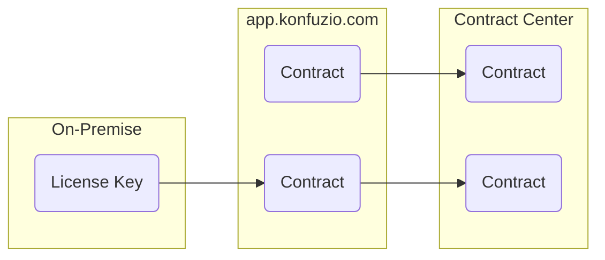

**Internal Documentation. This does not apply to on-premises Konfuzio Server installations.**

# Overview

The pricing of Konfuzio is based on the number of Pages a user assigned to one Contract processes. a user processes. This pricing is enforced by configuring Konfuzio Server as 'Contract Center'(https://it.vertragscenter.com/).


## Set up Konfuzio Server as Contract Center

### To activate the billing, you need:
1. Set `IS_BILLING_ACTIVATED` environment variable to `True`
2. Run migrations
3. If this is set up on localhost, port forwarding to receive webhooks is needed ([Ngrok](https://ngrok.com/) can be used for this).
4. Please set `WEBHOOK_RANDOM_SECRET` environment variable to a random string.

After that we continue with the setup of Fakturia. 

1. Login into Fakturia [Sandbox](https://backoffice.sandbox.fakturia.de/public/login.html) or [Production](https://backoffice.fakturia.de/public/login.html) dashboard and access the [webhooks](https://backoffice.sandbox.fakturia.de/secure/tenant/Webhook/Webhook.html) page.
2. Then you need to create new webhook instance clicking `Neuen Webhook anlegen` button
3. You will need to fill with the following values:  
- URL: `{your_text_annotation_server_address}/webhook/fakturia/{WEBHOOK_RANDOM_SECRET}/`  
- From `Verfügbare Events` select next: 
  - Kunde angelegt  
  - Kunde geändert  
  - Kunde gelöscht  
  - Vertrag angelegt  
  - Vertrag aktiviert  
  - Vertrag geändert  
  - Vertrag gelöscht  
  - Vertrag gekündigt 
  - Vertrag beendet (Vertragsende erreicht)  

.. image:: ./webhook.png

Click `Webhook speichern` button

4. Then open `Project` page. Click on edit button for any existing project. Go to the `Schnittstelle` tab.
5. You will need a copy a `Api-Key` value from this page and set the `FAKTURIA_API_KEY` environment variable to it.
Also set `https://api.sandbox.fakturia.de/api/v1/` (for test environment) to `FAKTURIA_API_URL` environment variable.
Also on Project edit page add your IP address to `Neuen API-Key generieren` list and click `Projekt speichern`.

Now everything is ready to be used. You can create customers and subscriptions for them on Fakturia side and 
it will appear on your server. 

## Overview of Environment Variables

```
# Turn billing on/off (optional).
IS_BILLING_ACTIVATED=True
# Randomize the webhook URL (optional).
BILLLING_WEBHOOK_RANDOM_SECRET=secret
# The Billing API Key (mandatory, if billing is enabled).
BILLLING_API_KEY=xxxxxxx-yyyyy-zzzzzzzz
# The Billing Server (mandatory, if billing is enabled).
BILLLING_API_URL=https://api.sandbox.fakturia.de/api/v1/ or https://api.fakturia.de/api/v1/
# The default contract to which all new Users are added automatically.
BILLLING_DEFAULT_CONTRACT_ID = 100
# The default value for new Contracts for included Pages (optional).
BILLLING_ALLOWED_UPLOAD_COUNT=1
# The default value for the article number of additional Pages in new Contracts (optional).
BILLING_OVERLIMIT_ARTICLE_NUMBER_NEW_CONTRACTS = 'Overlimited_page'
# The default value for the article number of included Pages in new Contracts (optional).
BILLING_SUBSCRIPTION_ARTICLE_NUMBER_CONTRACTS = '00001'
```

## On-Premise Setup
For on-premise installations, only BILLING_API_URL and BILLING_API_KEY are required. Additional information will added to [On-Premises Documentation](https://dev.konfuzio.com/web/on_premises.html).

## Management on app.konfuzio.com
Konfuzio Server will display a Billing Module to manage Contracts and Customers if is configured as Contract Center. On-premise installations will not see the Billing Module. Konfuzio Server is running as Contract Center if the HOST_NAME is part of '\*.konfuzio.com' and if the BILLING_API_URL is set to '\*.fakturia.de'.
