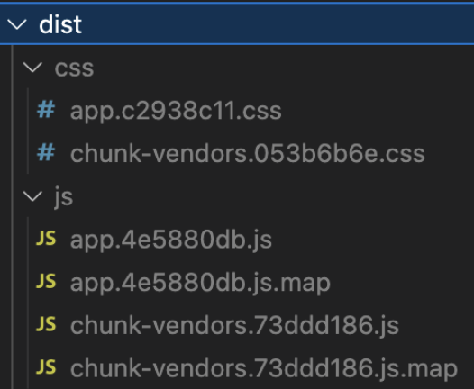
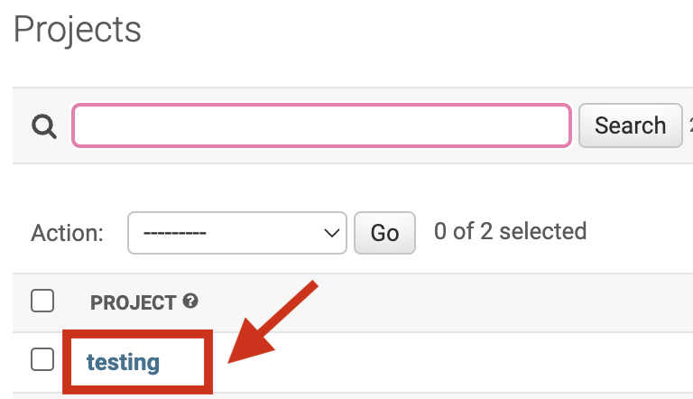
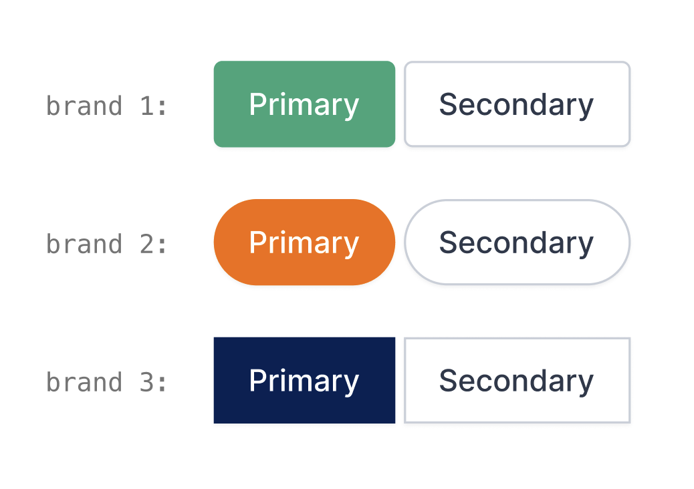

.. meta::
:description: this section explains the different user and mode options available in the Document Validation UI

# Explanations

## Managing users in the Konfuzio Document Validation UI

There are two options to manage users in the Document Validation UI:

- The first option is to [create a single user](https://app.konfuzio.com/accounts/signup/) with limited permissions (i.e. with the [Reader role](https://help.konfuzio.com/modules/superuserroles/index.html)) and [user token](https://app.konfuzio.com/v3/swagger/#/auth/auth_create), that anyone who interacts with the user interface can use in a Project. Since the token will be public, this option is best suited for a read-only view.
- The second one is to create as many users as needed, each with its token. This is best suited for Projects that use [single sign-on authentication](https://dev.konfuzio.com/web/api-v3.html#single-sign-on-sso-authentication) and/or where users will be interacting with the Documents (annotating and revising) since it allows for fine-grained control over who can access what, and it allows the application to keep a record of the different actions performed by them.

## Read Only Mode vs. Full Mode

The Konfuzio Document Validation UI can be configured to be run as Read Only or Full Mode:

### Read Only Mode

This is the default mode of the app. In this mode, you will have a sample Document with Annotations that you can only preview. Unless configured, it uses the default API endpoint at https://app.konfuzio.com and no user account is needed.

### Full Mode

If you want to run the widget in full mode to be able to interact with the Document by editing Annotations, Document Pages, and other functionalities, you will need to have a user account created (more information in our [Managing users](/dvui/explanations.html#managing-users-in-the-konfuzio-document-validation-ui) section). Then, you should generate a user token by accessing the [Konfuzio API version 3 Auth Request](https://app.konfuzio.com/v3/swagger/) and making a request with your username and password. If the provided credentials are correct, then a Token will be generated that you can copy and add to the `.env` file (see below for more details).

You will also need a [Document uploaded](https://app.konfuzio.com/v3/swagger/#/documents/documents_create) and a Document id, and will need to be logged in to [Konfuzio](https://app.konfuzio.com/)) before being able to upload the Document. After successfully uploading it, if you want to show it on the Document Validation UI, you can copy the Document id from the URL, as shown in the image below:

.. image:: ./images/docid.png

To complete the setup, create an environment variables file `.env` on the root of the repository based on the [.env.example](https://github.com/konfuzio-ai/document-validation-ui/blob/main/.env.example) for specifying the following values:

- The user token
- The Document id

Some other optional variables you can include are:

- The API URL
- The images URL
- The default language of the app
- The Category ID

You can also set the Document id through the URL query parameters like `?document=ID`. This will have priority over any other Document id that is set on `.env` or in `index.html`. For the other variables, the `.env` will also have priority from the ones defined in the HTML.

## Multilingual User Interface

The Document Validation UI can currently be used in three languages: German (de), English (en), and Spanish (es). You can specify what the default language of the application will be in the `.env` file, like so:

```
VUE_APP_I18N_LOCALE=
VUE_APP_I18N_FALLBACK_LOCALE=
```

You can also specify the language in the `HTML` file:

```
<div id="app">
    <app locale="de/en/es"></app>
  </div>
```

If left empty, then the default `en` will be used.

You are also welcome to create a new locales file for a language not currently provided by us, considering the data from [our existing files](https://github.com/konfuzio-ai/document-validation-ui/tree/main/src/locales), and share it with us via a [Support Ticket](https://konfuzio.com/en/support/) or create a Pull Request to add it to the repository.

## How to integrate the Document Validation UI into custom solutions?

The application requires `node` and `npm` to run. It also requires a connection to the [Konfuzio Server API version 3](https://app.konfuzio.com/v3/swagger/). See [full documentation](https://dev.konfuzio.com/web/api-v3.html).

There are a few different options to integrate the Document Validation UI into your Project, which we will explain next.

### Install as an NPM package

If you want to integrate the Document Validation UI into an existing application, you can run the following command in your terminal to install our [npm package](https://www.npmjs.com/package/@konfuzio/document-validation-ui):

`npm i @konfuzio/document-validation-ui`

#### Configure the application

Once the package is installed, you can configure the application in two ways:

##### Pointing to the dist folder

You can use the compiled version under the `dist` folder on the package source, by pointing to it from the `index.html` and making any necessary changes to the `HTML` properties on the `App` tag.


##### Using a JavaScript bundler

If you want more integration with your current configuration, you can use a JavaScript bundler. You can find an example using [Webpack](https://webpack.js.org/guides/getting-started/) below:

###### webpack.config.js

```
const VueLoaderPlugin = require("vue-loader/lib/plugin");

module.exports = {
    entry: {
        document_validation_ui: "./node_modules/@konfuzio/document-validation-ui/src/main.js",
    },
    output: {
        path: "/server/bundle",
        publicPath: "/bundle/",
        filename: "[name].js",
        sourceMapFilename: "[name].js.map",
    },
    module: {
        rules: [
            {
                test: /\.vue$/,
                loader: "vue-loader",
                options: {
                    sourceMap: true,
                },
            }
        ],
    },
    plugins: [
        new VueLoaderPlugin()
    ],
};
```

##### HTML

In the `HTML`, we should load the script we created with Webpack or the compiled version under the `dist` folder, and customize the variables we want. Please note that customizing the variables is optional and that any variable in the `.env` will have priority from the variables defined in the `index.html`.

The following examples, based on the two configuration options mentioned before, include the custom variables (Document id, user token, locale), but it is not mandatory to add these, which should still be added to the `.env` file.

###### Webpack bundle

```
 <div id="app">
    <app document="document_id" user_token=”user_token” locale="de/en/es"></app>
  </div>

   <script src="/server/bundle/document_validation_ui.js"></script>

```

###### Imports from the dist folder

```
<head>
    <script
      defer="defer"
      src="node_modules/@konfuzio/document-validation-ui/dist/js/chunk-vendors.js"
    ></script>
    <script
      defer="defer"
      src="node_modules/@konfuzio/document-validation-ui/dist/js/app.js"
    ></script>
    <link
      href="node_modules/@konfuzio/document-validation-ui/dist/css/chunk-vendors.css"
      rel="stylesheet"
    />
    <link
      href="node_modules/@konfuzio/document-validation-ui/dist/css/app.css"
      rel="stylesheet"
    />
</head>

<body>
 <div id="app">
    <app document="document_id" user_token=”user_token” locale="de/en/es"></app>
  </div>
</body>
```

### Integrate with CDN

An alternative to using `npm` is to load JavaScript and CSS bundles from [CDN](https://en.wikipedia.org/wiki/Content_delivery_network).

You can simply add the corresponding links in the `script` and `link` tags in your `HTML`, as shown in the following example:

```
<script defer="defer" src="https://unpkg.com/@konfuzio/document-validation-ui@latest/dist/js/chunk-vendors.js"></script>
<script defer="defer" src="https://unpkg.com/@konfuzio/document-validation-ui@latest/dist/js/app.js"></script>
<link href="https://unpkg.com/@konfuzio/document-validation-ui@latest/dist/css/chunk-vendors.css" rel="stylesheet">
<link href="https://unpkg.com/@konfuzio/document-validation-ui@latest/dist/css/app.css" rel="stylesheet">

<div id="app" style="height: 100vh">
  <app document="document_id" user_token=”user_token” locale="de/en/es"
></app>
</div>
```

### Integrate by deploying the application

You can also deploy the application by following the steps below:

1. Clone the repository

You can download the application by cloning our [GitHub repository](https://github.com/konfuzio-ai/document-validation-ui) or downloading the source code.

`git clone git@github.com:konfuzio-ai/document-validation-ui.git`

2. Configure the Application

Decide if the application will be run as [Read Only or Full Mode](./modes.md).

3. Install all packages

Install all the dependencies by running:

`npm install`

4. Run the Application

#### Deploy

If you want to deploy this application in a web server environment then you should run:

`npm run build`

When succeeded, you should export the `dist` folder generated from that command to the destination source in the host server and configure the web server engine to have the `index.html` file as the entry point. If everything is correctly configured you should be able to open the server URL and the application will load.



#### Local Development

If you want to serve the application locally to run on a browser (default URL: http://localhost:8080) you should run:

`npm run serve`

### Run the Document Validation UI in non-Vue applications

If your application is developed using technologies other than Vue (for example React or Angular), you can build the Document Validation UI app into a package, as described in our [configuration example](#configure-the-app), and import it to your existing project, or install it as an npm package.

#### Run in React

You can find a full example of using the Document Validation UI in a React application [here](https://medium.com/@pateldhruv020/using-vue-component-in-react-9161f30d29a0).

#### Run in Angular

At [this link](https://www.ais.com/using-a-vue-component-in-an-angular-app/) you will see a step-by-step on how to use the Document Validation UI in an Angular application.

### Iframe integration

#### HTML iframe as Public Document

You can mark your Documents as public. Marking Documents as "public" will generate a read-only, publicly accessible URL that does not require authentication. This allows you to share a link to the Document and its extracted data, or embed it in another website. See [Read Only mode](./modes.md/#read-only-mode) for reference.

##### Share a Document with a link

From the details page, you can copy a public URL to your Document, which you can share with other people. Apart from the URL, it does not contain any Konfuzio branding.

This lightweight version contains an image version of the PDF pages, and its currently extracted metadata (Annotation sets, Label sets, Labels). Any modification you make to the Document in the Document Validation UI is reflected here.

Currently, this public view is not allowed to be indexed by search engines.

If you need to programmatically generate public links, you can use the format `https://app.konfuzio.com/d/<id>/`. You can retrieve the ID of a Document from your Konfuzio dashboard or the API. Document ids that don’t exist or are not public will return a 404 error.

#### Embed a Konfuzio Document on another website

From the details page, you can copy an example HTML snippet that allows you to embed a public Document within an iframe. Visually, it looks the same as the above-mentioned public Document view, and in fact, its internal implementation is the same. However, to prevent abuse, you first need to configure your Project’s “domain whitelist” setting. This only needs to be done once per Project for each domain you want to allow.

#### Add your domain(s) to the Project’s domain whitelist

On the Konfuzio Dashboard, open the left-side menu and click “Projects”.


Click on the Project associated with the Document(s) you want to make public.



In the “Domain whitelist” field, add the domains where you’re going to embed your Document(s), one per line and without “http” or “https”.

For example, if you want to embed a Document on https://www.example.org, you should add www.example.org to the list.


Click “Save”.


_It is important to note that this process will NOT make all your Projects’ Documents public by default. It simply establishes which domains are allowed to embed public Documents for this Project. You will still need to mark Documents as public by yourself._

#### Customize the iframe

By default, we provide a bare-bones HTML snippet that looks similar to this:

`<iframe src="https://app.konfuzio.com/d/<id>/" width="100%" height="600" frameborder="0"></iframe>`

This creates on your page an iframe with 100% width (full width of its container) and a height of 600 pixels that don't have a border. You can customize the iframe‘s size and other options by changing these and other attributes (see [iframe documentation](https://developer.mozilla.org/en-US/docs/Web/HTML/Element/iframe)).


## How to customize the Document Validation UI?

With our software, you can change the primary color of the user interface to match your brand. This allows you to create a seamless experience for your users and reinforce your brand identity.
To change the primary color, simply add a `:root` pseudo-class to your `CSS` file or inside a `<style>` tag in your `index.html`, inside which you can set the variable `--primary-color` to your custom hue to match your exact brand color (see an example [here](#how-to-add-the-custom-variables-to-your-project)).
Once you’ve selected your desired color, the user interface will update in real-time to reflect your changes. This means that you can easily experiment with different color options until you find the perfect match for your brand.

In addition to the primary color, you also have the ability to customize other aspects of the user interface, such as the button border-radius. Whether your brand has sharp angles or soft curves, we allow you to make the perfect adjustments to achieve the look and feel that you want. For this customization, all you have to do is set a second variable `--primary-button` to the desired value.



### How to add the custom variables to your project?

Below are two examples of how to set the custom variables, whether in the `index.html` or in a dedicated `CSS` file.

_Please note that the default values from the examples below are based on Konfuzio's default styles._

.. \_custom-variables-html:

#### HTML

```
<div id="app">
   <app document="id" locale="de/en/es" user_token="token"></app>
 </div>

<style>
  :root {
    --primary-color: #41AF85;
    --primary-button: 4px;
  }
</style>
```

.. \_custom-variables-css:

#### CSS file

```
:root {
    --primary-color: #41AF85 !important;
    --primary-button: 4px !important;
  }
```

### Try it out before adding it to your project

If you want to test the final result before making changes to your application, you can do so [here](https://codepen.io/konfuzio/pen/QWVpKVE).

_The example from Codepen shows the Read only mode of the Document Validation UI, which has limited functionalities. To see all the features the UI has to offer, you can add your [user token](https://app.konfuzio.com/v3/swagger/#/auth/auth_create) and change the Document id in the `app` tag._

We hope this feature will help you take your branding to the next level and provide an even more engaging experience for your users. If you have any questions or need assistance with customization, please don’t hesitate to contact [support](https://konfuzio.com/en/support/).
