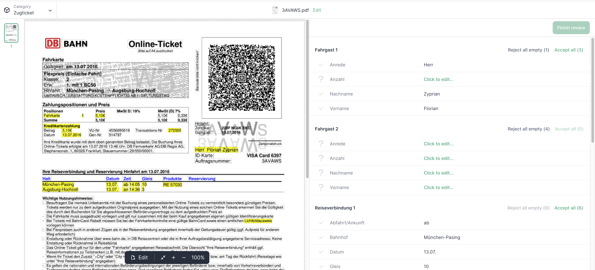

# Guides

## How to integrate the Document Validation UI into custom solutions?

The app requires `node` and `npm` to run. It also requires a connection to the [Konfuzio Server API version 3](https://app.konfuzio.com/v3/swagger/). See [full documentation](https://dev.konfuzio.com/web/api-v3.html).

There are a few different options to integrate the Document Validation UI into your Project, which we will explain next.

### Install as an NPM package

If you want to integrate the Document Validation UI to an existing application, we recommend installing the available package on the [npm repository](https://www.npmjs.com/package/@konfuzio/capture-vue).

#### Configure the app

Once the package is installed, you can configure the app using a JavaScript bundler. You can find an example using [Webpack](https://webpack.js.org/guides/getting-started/) below:

##### webpack.config.js

```
const VueLoaderPlugin = require("vue-loader/lib/plugin");

module.exports = {
    entry: {
        capture_vue: "./node_modules/@konfuzio/capture-vue/src/main.js",
    },
    output: {
        path: "/server/bundle",
        publicPath: "/bundle/",
        filename: "[name].js",
        sourceMapFilename: "[name].js.map",
    },
    module: {
        rules: [
            {
                test: /\.vue$/,
                loader: "vue-loader",
                options: {
                    sourceMap: true,
                },
            }
        ],
    },
    plugins: [
        new VueLoaderPlugin()
    ],
};
```

##### HTML

In the html we should load the script we created with the webpack and customise the variables we want. Please note that customising the variables is optional and that, as previously mentioned, any variable in the `.env` will have priority from the variables defined in the `index.html`.

The following example includes the custom variables (Document id, Category id, User Token, Locale), but it is not necessary to add these.

```
 <div id="app">
    <App document="DOCUMENT_ID" category="CATEGORY_ID" user_token:”USER_TOKEN” locale="LOCALE"></App>
  </div>

  <script src="/server/bundle/capture_vue.js"></script>
```

### Integrate by deploying the app

You can also deploy the app by following the steps below:

1. Clone the repository

You can download the app by cloning our GitHub repository or downloading the source code.

`git clone git@github.com:konfuzio-ai/konfuzio-capture-vue.git`

2. Configure the App

Decide if the app will be run as [Read Only or Full Mode](./modes.md).

3. Install all packages

Install all the dependencies by running:

`npm install`

4. Run the App

#### Deploy

If you want to deploy this app in a web server environment then you should run:

`npm run build`

When succeeded, you should export the `dist` folder generated from that command to the destination source in the host server and configure the web server engine in order to have the `index.html` file as the entry point. If everything is correctly configured you should be able to open the server URL and the app will load.


#### Local Development

If you want to serve the app locally to run on a browser (default URL: http://localhost:3000) you should run:

`npm run serve`

### Run the Document Validation UI in non-Vue applications

If your application is developed using technologies other than Vue (for example React or Angular), you can build the Document Validation UI app into a package, as described in our installation guide, and import it to your existing project, or install it as an npm package.

#### Run in React

You can find a full example on using the Document Validation UI in a React application [here](https://medium.com/@pateldhruv020/using-vue-component-in-react-9161f30d29a0).

#### Run in Angular

In [this link](https://www.ais.com/using-a-vue-component-in-an-angular-app/) you will see a step by step on how to use the Document Validation UI in an Angular application.

### Iframe integration

#### HTML iframe as Public Document

You can mark your Documents as public. Marking Documents as public will generate a read-only, publicly accessible view that does not require authentication. This allows you to share a link to the Document and its extracted data, or embed it in another website.

##### Share a Document with a link

From the details page, you can copy a public URL to your Document, which you can share with other people. Apart from the URL, it does not contain any Konfuzio branding.

This lightweight version contains an image version of the PDF pages, and its currently extracted metadata (Annotation sets, Label sets, Labels). Any modification you make to the Document in the Document Validation UI is reflected here.

Currently this public view is not allowed to be indexed by search engines.

If you need to programmatically generate public links, you can use the format `https://app.konfuzio.com/d/<id>/`. You can retrieve the ID of a Document from your Konfuzio dashboard or the API. Document IDs which don’t exist or are not public will return a 404 error.

#### Embed a Konfuzio Document on another website

From the details page, you can copy an example HTML snippet that allows you to embed a public Document within an iframe. Visually, it looks the same as the above-mentioned public Document view, and in fact its internal implementation is the same. However, to prevent abuse, you first need to configure your Project’s “domain whitelist” setting. This only needs to be done once per Project for each domain you want to allow.

#### Add your domain(s) to the Project’s domain whitelist

On the Konfuzio Dashboard, open the left-side menu and click “Projects”.


Click on the Project associated with the Document(s) you want to make public.


In the “Domain whitelist” field, add the domains where you’re going to embed your Document(s), one per line and without “http” or “https”.

For example, if you want to embed a Document on https://www.example.org, you should add www.example.org to the list.


Click “Save”.


_It is important to note that this process will NOT make all your Projects’ Documents public by default. It simply establishes which domains are allowed to embed public Documents for this Project. You will still need to mark Documents as public by yourself._

#### Customise the iframe

By default, we provide a bare-bones HTML snippet that looks similar to this:

`<iframe src="https://app.konfuzio.com/d/<id>/" width="100%" height="600" frameborder="0"></iframe>`

This creates on your page an iframe with 100% width (full width of its container) and a height of 600 pixels that doesn’t have a border. You can customise the iframe‘s size and other options by changing these and other attributes (see [iframe documentation](https://developer.mozilla.org/en-US/docs/Web/HTML/Element/iframe)).


