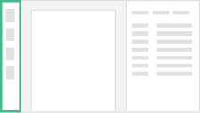
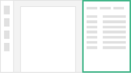

# Document Validation UI

The Document Validation UI is a collection of open source components, developed with [Vue.js](https://v2.vuejs.org/), that lets you preview and interact with Documents uploaded to [Konfuzio Server](https://konfuzio.com/).

Chrome (from version 51), Firefox (from version 54), Edge (from version 15) and Safari (from version 10) are supported in the latest version.

If you want to read the full user guide visit [this link](https://help.konfuzio.com/document-validation-ui/index.html).

## Components

The app has four main components:

### Document Thumbnails

This is a simple component that loads the Document images and displays them in a vertical list to act as a thumbnail selector. It is fully clickable and it updates its state automatically.

### Document Page

This component is responsible for drawing the Document and handling any interaction with it. The main thing is that it uses [Konva JS](https://konvajs.org/docs/vue/index.html) to render a canvas element that has the Document image as background and shapes on top. Most of the shapes are Annotations from the Konfuzio API.

### Document Annotations

This component is responsible for creating a list to interact with each Annotation on the Document. You can accept, decline or edit the Annotation, edit empty Labels and change the Annotation bounding box, among other things.

### Documents List

This is an optional component that is only loaded if a [Category](https://help.konfuzio.com/modules/categories/index.html) id is provided under the environment file. You also need to add an Authentication Token. Is responsible for loading the Documents list for a given Category and that are assigned to the currently authenticated user. You can then select which Document will appear on the dashboard.
