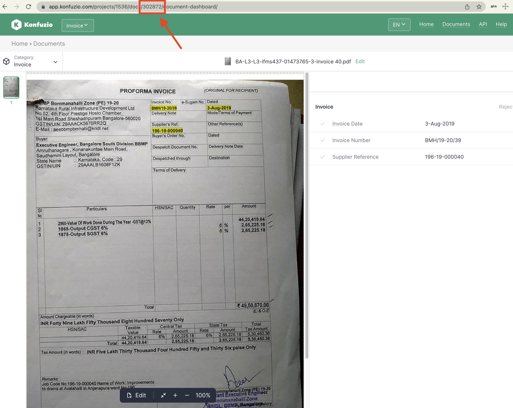

.. meta::
:description: description of the two possible modes to run the app

# Read Only Mode vs Full Mode

The Document Validation UI can be configured to be run as Read Only or Full Mode:

## Read Only Mode

This is the default mode of the app. In this mode, you will have a sample Document with annotations that you can only preview. The default API endpoint will be https://app.konfuzio.com and no user account is needed.

## Full Mode

If you want to run the widget in full mode to be able to interact with the Document by editing Annotations, Document pages and other functionalities, you will need to have a user account created (more information in our “Managing users” section). Then, you should generate a user Token, by accessing the [Konfuzio API version 3 Auth Request](https://app.konfuzio.com/v3/swagger/) and making a request with your username and password. If the account exists, then a Token will be generated that you can copy.

You will also need a [Document uploaded](https://app.konfuzio.com/v3/swagger/#/documents/documents_create) and a Document id, and will need to be logged in to [Konfuzio](https://app.konfuzio.com/)) before being able to upload the Document. After successfully uploading it, if you want to show it on the Document Validation UI, you can copy the Document id from the URL, as shown in the image below:

You can create an environment variables file `.env` on the root of the repository based on the [`.env.example`](https://github.com/konfuzio-ai/konfuzio-capture-vue/blob/main/.env.example) for specifying various options, especially the API endpoint, the user Token, the Document id and Category to load (optional), and the default language of the app.

Please be aware that any variable in the `.env` will have priority from the variables defined in the `index.html`.
