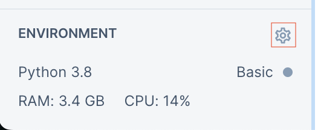
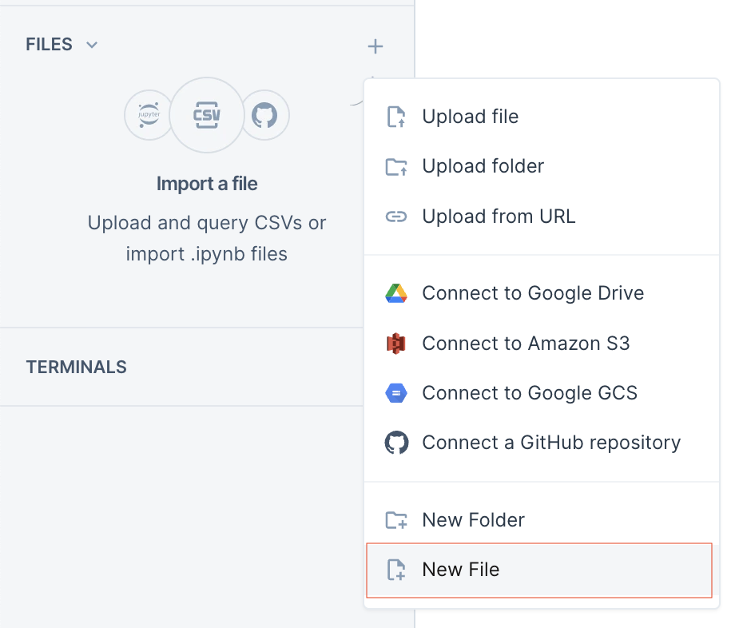

## Install SDK

To test our SDK you need to have an account in the Konfuzio Server and initialize the package before using it. If you 
are using PyCharm have a look at [Quickstart with Pycharm](quickstart_pycharm.html).

### 1. Sign up in Konfuzio Server

[Register for free](https://app.konfuzio.com/accounts/signup/) in the Konfuzio Server.

### 2. Install `konfuzio_sdk` package

* Install the Python package directly in your working directory with:

  `pip install konfuzio_sdk`

* It is also possible to choose between the lightweight SDK and the SDK with the AI-related components (latter one is 
taking up more disk space). By default, the SDK is installed as a lightweight instance. To install the full instance,
run the following command:

  `pip install konfuzio_sdk[ai]`
  
  Currently, the full instance cannot be installed on MacOS machines with an ARM-based chip from the M-series. The `konfuzio_sdk` package can only be installed on MacOS on machines with an ARM chip if the lightweight instance is installed. However the Konfuzio SDK can be used on a hosted environment such as [Deepnote](https://deepnote.com/). Follow the instructions in the next section to install the SDK in Colab.

### 2.1 Install the SDK in a hosted Jupyter environment
This procedure is not recommended, but documented here for completeness. Due to a limitation in Deepnote's ability to receive input from the user, the SDK cannot be initialized in a Deepnote notebook. To work around this limitation, we need to install and authenticate access to the SDK in a Colab notebook and then import the credentials in the Deepnote project.

If you don't have one, [create](https://deepnote.com/sign-up) an account. Once you are logged in, create a new project and choose the `Python 3.8` environment.

To change the environment, access the project settings by clicking on the gear icon on bottom left of the page:
<p align="center">
  
</p>

Choose Python 3.8 from the dropdown menu:
<p align="center">
  
</p>

Create a file called `.env` in the root of the Deepnote project. We will later use this file to store the credentials we obtained via the Colab notebook:
<p align="center">
  
</p>

To install the SDK in Deepnote, run the following commands in a new Notebook cell:
```
!git clone https://github.com/konfuzio-ai/konfuzio-sdk.git
!sed -i 's/torch>=1\.8\.1/torch==1.8.1/' konfuzio-sdk/extras_list.py
```

In a new cell run `!cat konfuzio-sdk/extras_list.py` to check we have the right version of the `torch` library. Inspect the output of the command, at the bottom of it you should see the following:
```  
'ai': [
    'chardet==5.1.0',
    'pydantic==1.10.8',  # pydantic is used by spacy. We need to force a higher pydantic version to avoid
    # https://github.com/tiangolo/fastapi/issues/5048
    'torch==1.8.1',
    ...
``````
Make sure that the `torch` line has `==` symbol, and not a `>=` one. If that is the case, we are now ready to actually install the SDK. In a new cell run:
```
!cd konfuzio-sdk && pip install .[ai]
```
If the installation does not complete successfully, restart the Deepnote notebook and run the same cell again. It is not necessary to run the previous cells again. To restart the notebook press the refresh arrow at the top of the page:
<p align="center">
  
</p>
Once the status changes back to `Ready`, run the cell with the `install` command again.

As mentioned earlier, before we can use the SDK within Deepnote we need to obtain the authorization token using a Colab notebook instance. We now install the SDK in a Colab notebook and copy the credentials to the `.env` file in the Deepnote project.

To install the SDK in Colab, run the following commands in a new [Colab](https://colab.research.google.com/) notebook cell:
```
!pip install konfuzio_sdk[ai]
import konfuzio_sdk
!konfuzio_sdk init
```
Follow the instructions in the terminal to initialize the SDK. Once the SDK is initialized an `.env` file will exist your root Colab folder. This file contains the credentials to access the Konfuzio server. Open it, copy the content and paste it into the new file we created in the Deepnote project. The `.env` file should look like this:
```
KONFUZIO_HOST = https://app.konfuzio.com
KONFUZIO_USER = your@email
KONFUZIO_TOKEN = <40-char token>
```

The Konfuzio SDK is now ready to be used in your Deepnote notebook. To test it, create a new cell and run:
```
from konfuzio_sdk.data import Project
PROJECT_ID = <your-project-id>
my_project = Project(id_=PROJECT_ID)
```
If no error is raised, the SDK is correctly installed and authenticated.

> **TIP:**
  Your project ID can be obtained by the web app URL when accessing Konfuzio from your browser. From your home page, navigate to `Projects` and pick the project you want to work with. Then look at the URL in your browser. Your should see something like `https://app.konfuzio.com/admin/server/project/<project-id>/change/` where `<project-id>` is your project ID.
 
---

*Notes*:

* Supported Python environments are 3.8, 3.9, 3.10, 3.11.
* Please use Python 3.8 if you plan to upload your AIs to a self-hosted Konfuzio Server environment. 
* If you are not using a virtual environment, you may need to add the installation directory to your PATH.
* If you run this tutorial in Colab and experience any version compatibility issues when working with the SDK, restart 
the runtime and initialize the SDK once again; this will resolve the issue.

### 3. Initialize the package

After the installation, initialize the package in your working directory with:

`konfuzio_sdk init`

This will require your credentials to access the Konfuzio Server.
At the end, one file will be created in your working directory: `.env`.

The `.env` file contains the credentials to access the app and should not become public.

### 4. Download the data

To download the data from your Konfuzio project you need to specify the Project ID.
You can check your Project ID by selecting the project in the Projects tab in the Web App.
The ID of the Project is shown in the URL. Suppose that your Project ID is 123:

`konfuzio_sdk export_project 123`

The data from the documents that you uploaded in your Konfuzio project will be downloaded to a folder called `data_123`.

*Note*:
Only Documents in the Training and Test sets are downloaded.
