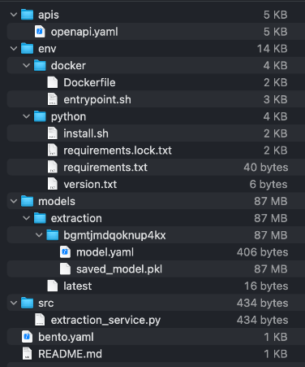

## Containerization of AIs

To ensure safety, flexibility, retrocompatibility and independency, we store and run AIs using 
[Bento ML](https://docs.bentoml.org/en/latest/?_gl=1*hctmyy*_gcl_au*NzY2ODYxNDY1LjE3MDY1MzU5NTk.#) containerization 
framework. 

When a model is saved, it uses the latest schema version from `bento.ai_type.schemas.py` which specifies how the service 
communicates with the Server. After that, a model becomes part of a Bento archive.

Inside the Bento archive, there are a lockfile with dependencies, the Python runtime version, the pickled model itself, 
a Dockerfile and a Python file that serves a REST API for the model. It also specifies the schema version for this model.



To save a model as a Bento instance, use `save_bento()` method of an AI class that you want to save, for instance:

```python
from konfuzio_sdk.trainer.information_extraction import RFExtractionAI

model = RFExtractionAI()
model.save_bento()
```

Running this command will result in a Bento creation in your local Bento storage. If you wish to specify an output for
a Bento archive, you can do this via the following command:

```python
model.save_bento(output_dir='path/to/your/bento/archive.bento')
```

The resulting Bento archive can be uploaded as a custom AI to the Server or an on-prem installation of Konfuzio. 

If you want to test that your Bento instance of a model runs, you can serve it locally using the next command:

```commandline
bentoml serve name:version # for example, extraction_11:2qytjiwhoc7flhbp
```

After that, you can check the Swagger for the Bento on `0.0.0.0:3000` and send requests to the available endpoint(s).

To run a Bento instance as a container and test it, use a following command:

```commandline
bentoml containerize name:version # for example, extraction_11:2qytjiwhoc7flhbp
```

### Document processing with a containerized AI

All Documents go through several steps during the processing pipeline that includes containerized AIs. 

The first step is always the same: transforming a Document into a JSON that adheres to a predefined Pydantic schema. This is needed to send the data
to the container with the AI because it's not possible to send a Document object directly.

| AI type  | Processing step | Conversion function  | Input  | Output     |   
|-----------|-------------------|-------------------------|----------|-------|
| Categorization | Convert a Document object into a JSON request | `konfuzio_sdk.bento.categorization.utils.convert_document_to_request` | Document | JSON structured as the [latest request schema](https://dev.konfuzio.com/sdk/sourcecode.html#categorizationservice-pydantic-schemas) |
| Categorization | Recreate a Document object inside the container | `konfuzio_sdk.bento.categorization.utils.prepare_request` | JSON | Document |
| Categorization | Convert page-level category information into a JSON to return from a container | `konfuzio_sdk.bento.categorization.utils.process_response` | Categorized pages | JSON structured as the [latest response schema](https://dev.konfuzio.com/sdk/sourcecode.html#categorizationservice-pydantic-schemas) | 
| Categorization | Update page-level category data in an original Document | `konfuzio_sdk.bento.categorization.utils.convert_response_to_categorized_pages` | JSON | Updated Document |
| File Splitting | Convert a Document object into a JSON request | `konfuzio_sdk.bento.file_splitting.utils.convert_document_to_request` | Document | JSON structured as the [latest request schema](https://dev.konfuzio.com/sdk/sourcecode.html#splittingaiservice-pydantic-schemas) |
| File Splitting | Recreate a Document object inside the container | `konfuzio_sdk.bento.file_splitting.utils.prepare_request` | JSON | Document |
| File Splitting | Convert splitting results into a JSON to return from a container | `konfuzio_sdk.bento.file_splitting.utils.process_response` | List of Documents | JSON structured as the [latest response schema](https://dev.konfuzio.com/sdk/sourcecode.html#splittingaiservice-pydantic-schemas) | 
| File Splitting | Create new Documents based on splitting results | - | JSON | New Documents |
| Information Extraction | Convert a Document object into a JSON request | `konfuzio_sdk.bento.extraction.utils.convert_document_to_request` | Document | JSON structured as the [latest request schema](https://dev.konfuzio.com/sdk/sourcecode.html#rfextractionai-pydantic-schemas) |
| Information Extraction | Recreate a Document object inside the container | `konfuzio_sdk.bento.extraction.utils.prepare_request` | JSON | Document |
| Information Extraction | Convert info about extracted Annotations into a JSON to return from a container | `konfuzio_sdk.bento.extraction.utils.process_response` | Annotation and Annotation Set data | JSON structured as the [latest response schema](https://dev.konfuzio.com/sdk/sourcecode.html#rfextractionai-pydantic-schemas) |
| Information Extraction | Reconstruct a Document and add new Annotations into it | `konfuzio_sdk.bento.extraction.utils.convert_response_to_annotations` | JSON | Document |

The communication between Konfuzio Server (or anywhere else where the AI is served) and a containerized AI can be described as the following scheme:


If you want to containerize a custom AI, refer to the documentation on how to create and save a 
[custom Extraction AI](https://dev.konfuzio.com/sdk/tutorials/information_extraction/index.html#train-a-custom-date-extraction-ai),
a [custom File Splitting AI](https://dev.konfuzio.com/sdk/tutorials/create-custom-splitting-ai/index.html), 
or a [custom Categorization AI](https://dev.konfuzio.com/sdk/tutorials/create-custom-categorization-ai/index.html), respectively.