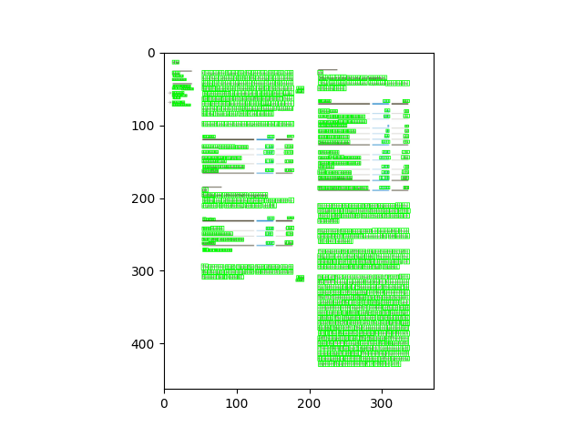
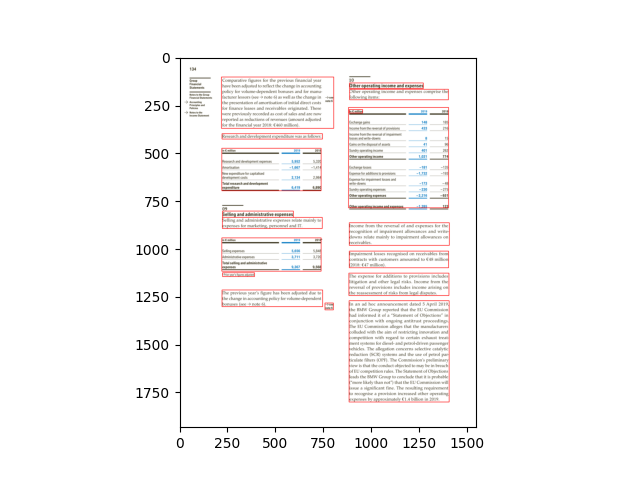
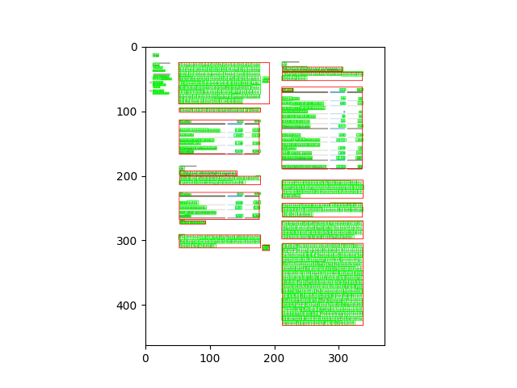

.. meta::
   :description: Documentation of the coordinates system of the bounding boxes used in Konfuzio and some simple 
examples of how to use it for visualization, for example.

## Coordinates System

The size of a page of a Document can be obtained in the Document object.
The format is [width, height].

Original size of the Document is the size of the uploaded Document (which can be a PDF file or an image). The bounding 
boxes of the Annotations are based on this size.
   E.g.: [1552, 1932]
   

Current size can be accessed via calling `height` and `width` from the Page object. They show the dimensions of the 
image representation of a Document Page. These representations are used for computer vision tasks and the SmartView.
   E.g.: [372.48, 463.68]

.. literalinclude:: /sdk/boilerplates/test_coordinates_system.py
   :language: python
   :lines: 2,5-13

The coordinates system used has its start in the bottom left corner of the page.


To visualize the character bounding boxes of a document and overlapping them in the image opened with the python
library PIL, for example, we can resize the image to the size in which they are based (original_size).
The following code can be used for this:

.. literalinclude:: /sdk/boilerplates/test_visualize_bboxes.py
   :language: python
   :lines: 2-6,8-21,24-29,31-41



The coordinates obtained from the segmentation endpoint of the API are based on the image array shape.
To visualize the segmentation bounding boxes of a page on an image opened with the python library PIL, for example,
we can overlap them directly.

```python
import cv2
import matplotlib.pyplot as plt
import numpy as np
from PIL import Image
from konfuzio_sdk.data import Project
from konfuzio_sdk.api import get_results_from_segmentation

my_project = Project(id_=YOUR_PROJECT_ID)
# first document uploaded
document = my_project.documents[0]
# index of the page to test
page_index = 0

document.get_images()
image_path = document.image_paths[page_index]
image = Image.open(image_path).convert('RGB')
image_segmentation_bboxes = get_results_from_segmentation(document.id_, my_project.id_)

for bbox in image_segmentation_bboxes[page_index]:
    pp1 = (int(bbox["x0"]), int(bbox["y0"]))
    pp2 = (int(bbox["x1"]), int(bbox["y1"]))
    image = cv2.rectangle(np.array(image), pp1, pp2, (255, 0, 0), 1)

plt.imshow(image)
plt.show()

```



To visualize both at the same time we can convert the coordinates from the segmentation result to be based on the image
size used for the characters' bbox.

```python
import cv2
import matplotlib.pyplot as plt
import numpy as np
from PIL import Image
from konfuzio_sdk.data import Project
from konfuzio_sdk.api import get_results_from_segmentation

my_project = Project(id_=YOUR_PROJECT_ID)
# first document uploaded
document = my_project.documents[0]
# index of the page to test
page_index = 0

doc_bbox = document.get_bbox()
document.get_images()
image_path = document.image_paths[page_index]

original_size = document.pages[page_index]['original_size']
size = document.pages[page_index]['size']

factor_x = original_size[0] / size[0]
factor_y = original_size[1] / size[1]

image = Image.open(image_path).convert('RGB')
image_factor = image.copy()

image = image.resize((int(image.size[0] * factor_x), int(image.size[1] * factor_y)))
height = image.size[1]

image_characters_bbox = [char_bbox for _, char_bbox in doc_bbox.items() if char_bbox["page_number"] - 1 == page_index]

for bbox in image_characters_bbox:
    pp1 = (int(bbox["x0"]), int((height - bbox["y0"])))
    pp2 = (int(bbox["x1"]), int((height - bbox["y1"])))
    image = cv2.rectangle(np.array(image), pp1, pp2, (0, 255, 0), 1)

image_segmentation_bboxes = get_results_from_segmentation(document.id_, my_project.id_)

for bbox in image_segmentation_bboxes[page_index]:
    pp1 = (int(bbox["x0"] * factor_x), int(bbox["y0"] * factor_y))
    pp2 = (int(bbox["x1"] * factor_x), int(bbox["y1"] * factor_y))
    image = cv2.rectangle(np.array(image), pp1, pp2, (255, 0, 0), 1)

plt.imshow(image)
plt.show()
```

