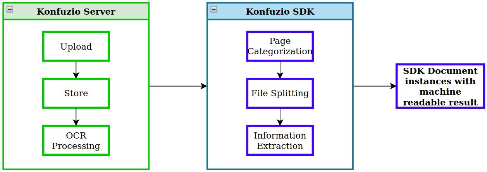

# What is the Konfuzio SDK?

## Overview

The Open Source Konfuzio Software Development Kit (Konfuzio SDK) provides a Python API to build custom document processes. For a quick introduction to the SDK, check out the [Quickstart](https://dev.konfuzio.com/sdk/home/index.html) section. Review the release notes and the source code on [GitHub](https://github.com/konfuzio-ai/konfuzio-sdk/releases).

| Section                                                           | Description                                                                                                 |
|-------------------------------------------------------------------|-------------------------------------------------------------------------------------------------------------|
| [Get Started](get_started.html)                                   | Learn more about the Konfuzio SDK and how it works.                                                         |
| [Tutorials](examples/examples.html)                               | Learn how to build your first document extraction pipeline, speed up your annotation process and many more. |
| [Explanations](explanations.html)                                 | Here are links to teaching material about the Konfuzio SDK.                                                 |
| [API Reference](sourcecode.html)                                  | Get to know all major Data Layer concepts of the Konfuzio SDK.                                              |
| [Contribution Guide](contribution.html)                           | Learn how to contribute, run the tests locally, and submit a Pull Request.                                  |
| [Changelog](https://github.com/konfuzio-ai/konfuzio-sdk/releases) | Review the release notes and the source code of the Konfuzio SDK.                                           |

## Use Cases

### Custom Extraction AI for financial reports

Create a custom Extraction AI specifically tailored to extract information from financial reports with ease.

- Use pre-built templates and customization options to train the AI to accurately identify and extract important data such as revenue figures, expenses, and profit margins
- Securely access and process large amounts of financial data using the Konfuzio Server, which is required to run the SDK
- Automate data entry and streamline financial analysis

The Konfuzio SDK is not limited to just financial reports, it can be used to extract information from a wide range of documents, 
such as contracts, invoices, legal documents and technical reports.

### Custom Categorization AI for legal documents

Automatically classify your documents based on their type.

- Train the AI on a wide range of legal documents, such as:
  - Claim letters
  - Court summonses
  - Purchasing agreements
  - Payroll documents
  - Evidence documents
- Integrate the SDK with the Konfuzio Server to securely process and classify large amounts of legal documents
- Streamline document management and improve efficiency within your legal department

### PDF Form Generator

Streamline the process of creating and filling out PDF forms by coding a custom PDF Form Generator.

- Interface with our annotation tool via a Python API and easily create empty Annotations in your PDF forms
- Automatically fill in those Annotations with data using the SDK
- Quickly generate personalized PDF forms, such as contracts and invoices, and questionnaires, with minimal manual effort
- Use a popular PDF generation library, such as PyPDF2, to render the final PDF form with data filled in
