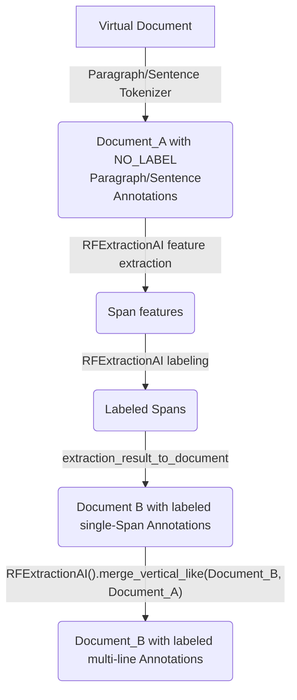

.. meta::
   :description: Documentation of the ExtractionAI merge logic.

# Merging of predicted Annotations

Our extraction AI runs a merging logic at two steps in the extraction process. The first is a horizontal merging of Spans right after the Label classifier. This can be particularly useful when using the [Whitespace tokenizer](https://dev.konfuzio.com/sdk/sourcecode.html#konfuzio_sdk.tokenizer.regex.WhitespaceTokenizer) as it can find Spans containing spaces. The second merging logic is a vertical merging of Spans into a single multiline Annotation. Checkout the [architecture diagram](https://dev.konfuzio.com/sdk/contribution.html#architecture-sdk-to-server) for more detail.

## Horizontal Merge

When using an [Extraction AI](https://dev.konfuzio.com/sdk/sourcecode.html#extraction-ai), we merge adjacent horizontal Spans right after the Label classifier. The confidence of the resulting new Span if taken to be the mean confidence of the original Spans being merged.

A horizontal merging is valid only if:
1. All Spans have the same predicted Label
2. Confidence of predicted Label is above the Label threshold
3. All Spans are on the same line
4. Spans are not overlapping
5. No extraneous characters in between Spans
6. A maximum of 5 spaces in between Spans
7. The [Label type](https://dev.konfuzio.com/web/api.html#supported-data-normalization) is not one of the following: 'Number', 'Positive Number', 'Percentage', 'Date'
 OR the resulting merging create a Span [normalizable](https://dev.konfuzio.com/web/api.html#supported-data-normalization) to the same type

|          Input          | Able to merge? | Reason | Result |
|:-----------------------:|:-----------:| :-----------: | :-----------: |
|  Text&nbsp;&nbsp;Annotation |      yes     |    /    | Text&nbsp;&nbsp;Annotation |
|  Text&nbsp;&nbsp;&nbsp;&nbsp;&nbsp;&nbsp;Annotation |      no     |    5.    | Text&nbsp;&nbsp;&nbsp;&nbsp;&nbsp;&nbsp;Annotation |
|  Text&nbsp;.&nbsp;Annotation |      no     |    4.    | Text&nbsp;.&nbsp;Annotation |
|  Annotation&nbsp;7 |      no     |    1.    | Annotation&nbsp;7 |
|  34&nbsp;&nbsp;&nbsp;&nbsp;98 |      no     |  6. ([see here](https://dev.konfuzio.com/web/api.html#numbers))  | 34&nbsp;&nbsp;&nbsp;&nbsp;98 |
|  34&nbsp;&nbsp;98 |      yes     |  /  | 34&nbsp;&nbsp;98 |
|  November&nbsp;2022 |     yes     |   /    | November&nbsp;2022 |
|  Novamber&nbsp;2022 |     no     |    6. ([see here](https://dev.konfuzio.com/web/api.html#date-values))   | Novamber&nbsp;2022 |
|  34&nbsp;&nbsp;98% |      yes     |  /  | 34&nbsp;&nbsp;98% |
|  34&nbsp;&nbsp;98% |      no     |  2.  | 34&nbsp;&nbsp;98% |

Label Type: Text 
Label Type: Number 
Label Type: Date 
Label Type: Percentage 
Label Type: NO LABEL/Below Label threshold

## Vertical Merge

When using an [Extraction AI](https://dev.konfuzio.com/sdk/sourcecode.html#extraction-ai), we join adjacent vertical Spans into a single Annotation after the LabelSet classifier. 

A vertical merging is valid only if:

1. They are on the same Page
2. They are predicted to have the same Label
3. Multiline annotations with this Label exist in the training set
4. Consecutive vertical Spans either overlap in the x-axis, OR the preceding Span is at the end of the line, and following Span is at the beginning of the next
5. Confidence of predicted Label is above the Label threshold
6. Spans are on consecutive lines
7. Merged lower Span belongs to an Annotation in the same AnnotationSet, OR to an AnnotationSet with only a single Annotation

|          Input          | Able to merge? | Reason |
|:-----------------------:|:----------:| :-----------: |
|  Text Annotation |      yes     |    /    | 
|  Annotation 42 |      no     |    2.    |
|  Text&nbsp;more text &nbsp;&nbsp;&nbsp;&nbsp;&nbsp;&nbsp;&nbsp;&nbsp;&nbsp;&nbsp;Annotation |     no     |    4.    | 
| Some random text&nbsp;Text Annotation |      yes     |    /    |
| Some random text&nbsp;Text&nbsp;&nbsp;. Annotation |      no     |    4.    |
|  Text&nbsp;more text &nbsp;&nbsp;&nbsp;&nbsp;Annotation &nbsp;&nbsp;&nbsp;&nbsp;&nbsp;&nbsp;&nbsp;&nbsp;42 |     yes     |    /    |
|  Text&nbsp; &nbsp;&nbsp;&nbsp;&nbsp;&nbsp;&nbsp;&nbsp;&nbsp;more text&nbsp;&nbsp;&nbsp;&nbsp; &nbsp;&nbsp;&nbsp;Annotation |     no     |    6.    |
|  Annotation&nbsp;&nbsp;Nb. &nbsp;&nbsp;&nbsp;&nbsp;&nbsp;&nbsp;&nbsp;&nbsp;&nbsp;&nbsp;&nbsp;&nbsp;&nbsp;&nbsp;&nbsp;&nbsp;&nbsp;&nbsp;&nbsp;&nbsp;&nbsp;&nbsp;42 |      yes     |   *  |
|  Annotation&nbsp;&nbsp;41 Annotation&nbsp;&nbsp;42 |      no     |    7. ** |

* The bottom Annotation is alone in its AnnotationSet and therefore can be merged. 
** The Annotations on each line have been grouped into their own AnnotationSets and are not merged.

Label 1 
Label 2 
NO LABEL/Below Label threshold

## Horizontal and Vertical Merge with the Paragraph and Sentence Tokenizers

When using the [Paragraph](https://dev.konfuzio.com/sdk/sourcecode.html#paragraph-tokenizer) or [Sentence Tokenizer](https://dev.konfuzio.com/sdk/sourcecode.html#sentence-tokenizer) together with our [Extraction AI model](https://dev.konfuzio.com/sdk/sourcecode.html#extraction-ai), we do not use the rule based vertical and horizontal merge logic above, and instead use the sentence/paragraph segmentation provided by the Tokenizer.

The logic is as follows:

And here's an illustrated example of the merge logic in action:

.. image:: /_static/img/merge_docs_gif.gif
