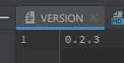

.. meta::
   :description: How to release a Python package automatically on PyPI including. The guide covers how to release pre-releases.

# Releasing Changes

Any changes released to the branch master, will be released to PyPI in the next release.

## How to release with GitHub to PyPI

1. Change the version number in the file VERSION use the format `v.X.X.X` without whitespaces.
   
2. Draft a Release [here](https://github.com/konfuzio-ai/konfuzio-sdk/releases/new).
   
   1. Create a new Tag on master, named as the version number in step 1.
   2. Add a title for the release
   3. Automatically generate the description using the Names of the merged Pull Requests
3. After you press publish release, a new Python Package will be uploaded to pypi by a GitHub Action, see code
   [here](https://github.com/konfuzio-ai/konfuzio-sdk/blob/master/.github/workflows/release.yml). You can verify 
   that the Release was uploaded via having a look on [PyPI](https://pypi.org/project/konfuzio-sdk/#history)

## How to use nightly builds?

1. Install the latest pre-release `pip install --pre konfuzio_sdk` 
2. Force to pick the latest pre-release the version `pip install konfuzio_sdk>=0.2.3.dev0`. As PEP440 states: The 
   developmental release segment consists of the string .dev, followed by a non-negative integer value.  
   Developmental releases are ordered by their numerical component, immediately before the corresponding  release 
   (and before any pre-releases with the same release segment), and following any previous release (including any  
   post-releases)

.. Note:: 
   Pre-Releases don't use tags but reference commits. The version number of a pre-release relates to the 
   Year-Month-Date-Hour-Minute-Second of last commit date on branch master used to create this release.

