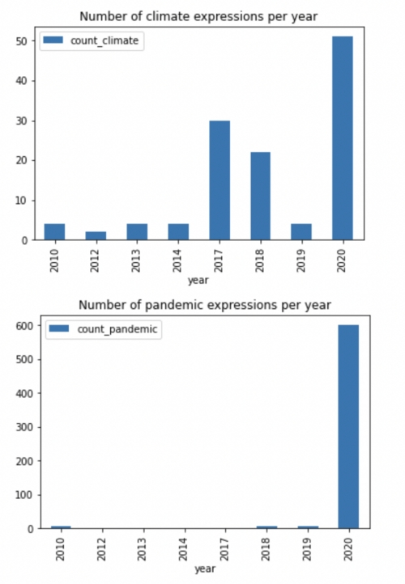

---
jupyter:
  jupytext:
    text_representation:
      extension: .md
      format_name: markdown
      format_version: '1.3'
      jupytext_version: 1.15.2
  kernelspec:
    display_name: Python 3 (ipykernel)
    language: python
    name: python3
---

## Find and calculate relevant words and expressions in annual reports

---

**Prerequisites:** 

- Data Layer concepts of Konfuzio: Document, Annotation, Project
- `pandas` and `matplotlib` installed
- Basic `pandas` knowledge
- Basic understanding of regular expressions

**Difficulty:** Medium

**Goal:** Explain how to find and calculate stats for occurrence of particular words and expressions in texts of Documents.

---

### Environment
You need to install the Konfuzio SDK before diving into the tutorial. \
To get up and running quickly, you can use our Colab Quick Start notebook. \
<a href="https://colab.research.google.com/github/konfuzio-ai/konfuzio-sdk/blob/master/notebooks/Quick_start_template_for_Konfuzio_SDK.ipynb" target="_parent"></a>

As an alternative you can follow the [installation section](../get_started.html#install-sdk) to install and initialize the Konfuzio SDK locally or on an environment of your choice.

### Introduction

Having data in a structured and organized way enables deeper analysis and understanding of information. An example, is the analysis of specific keywords in annual reports to know the subjects in which companies focus their attention and investments along the time.

The Konfuzio SDK allows to do this by creating Annotations in Documents of your Konfuzio Project. These Annotations can then be downloaded in a structured way, associating each Annotation to a certain Label and Document. This allows for different approaches to analysis. This tutorial guides you through how to identify and count pre-specified expressions in Documents.

The aim is to analyse how much sustainability plays a role in the annual reports of German companies over a certain time span, particularly in relation to the appearance of the Covid-19 pandemic.

### Make imports and initialize the Project


```python editable=true slideshow={"slide_type": ""} vscode={"languageId": "plaintext"} tags=["skip-execution", "nbval-skip"]
import re
import matplotlib.pyplot as plt
import pandas as pd
from konfuzio_sdk.data import Project, Annotation, Label

my_project = Project(id_=YOUR_PROJECT_ID)
```

Load the existing Documents or create new ones using the example Documents in the example folder with samples provided [here](https://drive.google.com/drive/folders/1iWPBdxHqR8j8CWUdbVHO7OzIxZsOXe-l). The Documents are annual reports from companies which are part of the prime standard (full list of companies in prime standard can be found [here](https://www.deutsche-boerse-cash-market.com/dbcm-de/instrumente-statistiken/statistiken/gelistete-unternehmen)).   

Alternatively, you can do this step directly on the Konfuzio Server by uploading the Documents there. For more details take a look [here](https://help.konfuzio.com/documents/receipt/index.html#upload-receipts).

```python editable=true slideshow={"slide_type": ""} tags=["skip-execution", "nbval-skip"]
documents = my_project.init_or_update_document(from_online=True)
```

### Specify the expressions you want to count

Our aim is to count expressions related to sustainability (here: _climate_expressions_) and expressions related to pandemics (here: _pandemic_expressions_). Hence, we specify certain words and expressions related to these subjects. These expressions will then be searched in the Documents of the Project to find exact matches. However, there is flexibility for lower- or uppercases.

```python editable=true slideshow={"slide_type": ""} tags=["skip-execution", "nbval-skip"]
climate_expressions = [re.compile("climate change|climate crisis|climate emergency|climate breakdown", re.I),
                       re.compile("global warming|global heating", re.I),
                       re.compile("Greenhouse Gas", re.I),
                       re.compile("carbon emission", re.I),
                       re.compile("renewable energy|renewable sources", re.I)]

pandemic_expressions = [re.compile("Corona", re.I),
                     re.compile("Covid", re.I),
                     re.compile("pandemic", re.I),
                     re.compile("lockdown", re.I)]
```

### Define the Labels

To do this, start by setting up a Label Set on Konfuzio app (_Label sets -> + Add Label Set_). It is important that each new Annotation gets assigned to a new Annotation Set, so tick the box "Multiple" to achieve this. Update your Project to get the new Label Set.

```python editable=true slideshow={"slide_type": ""} tags=["skip-execution", "nbval-skip"]
label_set = [label_set for label_set in my_project.label_sets if not label_set.is_default][0]
```

Now, you can add Labels to your respective Label Set. These Labels serve as containers for your Annotations. In our example, we cluster our Annotations into expressions either related to pandemic or to sustainability. Therefore, we create two Labels "Pandemic" and "Climate" to allocate the Annotations accordingly. Down below, we define the Label names of the Project we want to use and match them with the existing ones in our Project for the further proceeding.

```python editable=true slideshow={"slide_type": ""} tags=["skip-execution", "nbval-skip"]
labels_names = ['Pandemic', 'Climate']
for label in labels_names:
    _ = Label(project=my_project, text=label, label_sets=[label_set])
```

Collect the defined Labels and the correspondent Label Set(s).

```python editable=true slideshow={"slide_type": ""} tags=["skip-execution", "nbval-skip"]
labels = [label for label in my_project.labels if label.name in labels_names]

label_sets = [my_label.label_sets[0] for my_label in labels]
```

### Find matches for the expressions in the Documents

Now we will look for the expressions in the Documents which exactly match the expressions we defined above. If there is a match, it will be saved as Annotation and can be viewed on Konfuzio app in the SmartView of the respective Document.

```python editable=true slideshow={"slide_type": ""} tags=["skip-execution", "nbval-skip"]
expressions = {'Climate': climate_expressions, 'Pandemic': pandemic_expressions}

for document in documents:
    for label, label_set in zip(labels, label_sets):
    
        for exp in expressions[label.name]:
            matches = [(m.start(0), m.end(0)) for m in re.finditer(exp, document.text)]
        
            for match in matches:
                annotation_obj = Annotation(
                    document=document,
                    section=None,
                    document_id=document.id,
                    start_offset=match[0],
                    end_offset=match[1],
                    label=label,
                    label_set_id=label_set.id,
                    accuracy=1.0,
                    is_correct=True,
                    revised=True,
                )
        
                _ = annotation_obj.save()
```

If the Annotations have been created online, update the Documents with the saved Annotations.

```python editable=true slideshow={"slide_type": ""} tags=["skip-execution", "nbval-skip"]
for document in documents:
    document.get_document_details(update=True)
```

### Data analysis and visualization

Let's have a quick look into how many matches were found. The following code provides you with the Annotations per Label for each of our respective Documents separately, giving you the opportunity to analyze the annotations for the individual Documents.

```python editable=true slideshow={"slide_type": ""} tags=["skip-execution", "nbval-skip"]
for doc in documents:
    count_dict_doc= {}
    print("\n{}:".format(doc))

    for annotation in doc.annotations():
        label_name = annotation.label.name
        if label_name in labels_names:
            if label_name in count_dict_doc.keys():
                count_dict_doc[label_name] += 1
            else:
                count_dict_doc[label_name] = 1
                
    print(count_dict_doc)
```

If you posted Annotations on app, you can view them in the Smartview there. For a more complete and extensive analysis and to get a first glance about what is possible with the results we achieved with this tutorial, you can either use the provided code below or you can export the information from the Konfuzio server by downloading the data as a csv file.

To download the csv file, please follow [these](https://help.konfuzio.com/integrations/csv/index.html) steps. The csv provides you with further possibilities to work with the data and draw conclusions from it.

We chose to analyze the relation between the occurrences of sustainability and pandemic expressions, hence whether companies decreased their attention to sustainability issues with the rise of a global pandemic. In the code provided below, you can take a look at a first analysis drawn from the data we achieved with this analysis of the annual reports of the companies. 

Retrieve different information from the Documents of your Konfuzio Project and create a dataframe with these information for a better overview:

```python editable=true slideshow={"slide_type": ""} tags=["skip-execution", "nbval-skip"]
docs_info = []

for doc in documents:
  annot = doc.annotations()
  doc_info = {'name': doc.name,
              'ISIN': doc.name.split("_")[0],
              'year': doc.name.split("_")[1][:4],
              'ID': doc.id,
              'URL': doc.file_url,
              'status': doc.dataset_status,
              'n_pages': doc.number_of_pages,
              'topics_climate': len([a for a in annot if a.label.name == 'Climate']),
              'topics_pandemic': len([a for a in annot if a.label.name == 'Pandemic'])}
  
  docs_info.append(doc_info)

df = pd.DataFrame(data=docs_info)
```

Retrieve the total number of Pages of all annual reports present in the dataset as well as the total count of climate and pandemic expressions.
```python editable=true slideshow={"slide_type": ""} tags=["skip-execution", "nbval-skip"]
sum_pages = df['n_pages'].sum()
sum_topics_climate = df["topics_climate"].sum()
sum_topics_pandemic = df["topics_pandemic"].sum()
```

Look into the group the number of climate and pandemic expressions by year to analyze the development of occurrences of each one over the timespan from 2010 to 2020:

```python editable=true slideshow={"slide_type": ""} tags=["skip-execution", "nbval-skip"]
def count_per_year(dataframe, label):
    grouped = dataframe.groupby('year')['topics_' + label].sum()
    grouped_df = {'count_' + label: grouped}
    grouped_df = pd.DataFrame(data=grouped_df)
    grouped_df.plot(kind = 'bar')
    plt.title(f'Number of {label} expressions per year')
    
count_per_year(df, 'climate')
count_per_year(df, 'pandemic')
```

The resulting charts look the following way:



### Conclusion

In this tutorial, we have walked through the essential steps for retrieving information from annual reports based on search for particular words and expressions and researching the results for insights. Below is the full code to accomplish this task:

```python editable=true slideshow={"slide_type": ""} tags=["skip-execution", "nbval-skip"] vscode={"languageId": "plaintext"}
import re
import matplotlib.pyplot as plt
import pandas as pd
from konfuzio_sdk.data import Project, Annotation, Label

my_project = Project(id_=YOUR_PROJECT_ID)
documents = my_project.init_or_update_document(from_online=True)

climate_expressions = [re.compile("climate change|climate crisis|climate emergency|climate breakdown", re.I),
                       re.compile("global warming|global heating", re.I),
                       re.compile("Greenhouse Gas", re.I),
                       re.compile("carbon emission", re.I),
                       re.compile("renewable energy|renewable sources", re.I)]

pandemic_expressions = [re.compile("Corona", re.I),
                     re.compile("Covid", re.I),
                     re.compile("pandemic", re.I),
                     re.compile("lockdown", re.I)]

label_set = [label_set for label_set in my_project.label_sets if not label_set.is_default][0]

labels_names = ['Pandemic', 'Climate']
for label in labels_names:
    _ = Label(project=my_project, text=label, label_sets=[label_set])

labels = [label for label in my_project.labels if label.name in labels_names]

label_sets = [my_label.label_sets[0] for my_label in labels]

expressions = {'Climate': climate_expressions, 'Pandemic': pandemic_expressions}

for document in documents:
    for label, label_set in zip(labels, label_sets):
    
        for exp in expressions[label.name]:
            matches = [(m.start(0), m.end(0)) for m in re.finditer(exp, document.text)]
        
            for match in matches:
                annotation_obj = Annotation(
                    document=document,
                    section=None,
                    document_id=document.id,
                    start_offset=match[0],
                    end_offset=match[1],
                    label=label,
                    label_set_id=label_set.id,
                    accuracy=1.0,
                    is_correct=True,
                    revised=True,
                )
                
                _ = annotation_obj.save()

for document in documents:
    document.get_document_details(update=True)

for doc in documents:
    count_dict_doc= {}
    print("\n{}:".format(doc))

    for annotation in doc.annotations():
        label_name = annotation.label.name
        if label_name in labels_names:
            if label_name in count_dict_doc.keys():
                count_dict_doc[label_name] += 1
            else:
                count_dict_doc[label_name] = 1
                
    print(count_dict_doc)

docs_info = []

for doc in documents:
  annot = doc.annotations()
  doc_info = {'name': doc.name,
              'ISIN': doc.name.split("_")[0],
              'year': doc.name.split("_")[1][:4],
              'ID': doc.id,
              'URL': doc.file_url,
              'status': doc.dataset_status,
              'n_pages': doc.number_of_pages,
              'topics_climate': len([a for a in annot if a.label.name == 'Climate']),
              'topics_pandemic': len([a for a in annot if a.label.name == 'Pandemic'])}
  
  docs_info.append(doc_info)

df = pd.DataFrame(data=docs_info)

sum_pages = df['n_pages'].sum()
sum_topics_climate = df["topics_climate"].sum()
sum_topics_pandemic = df["topics_pandemic"].sum()

def count_per_year(dataframe, label):
    grouped = dataframe.groupby('year')['topics_' + label].sum()
    grouped_df = {'count_' + label: grouped}
    grouped_df = pd.DataFrame(data=grouped_df)
    grouped_df.plot(kind = 'bar')
    plt.title(f'Number of {label} expressions per year')
    
count_per_year(df, 'climate')
count_per_year(df, 'pandemic')
```

### What's next?

- [Learn more about how to create the Regex-based Annotations](https://dev.konfuzio.com/sdk/tutorials/regex_based_annotations/index.html)
- [Find out how to train a custom Extraction AI](https://dev.konfuzio.com/sdk/tutorials/information_extraction/index.html#train-a-custom-date-extraction-ai)

