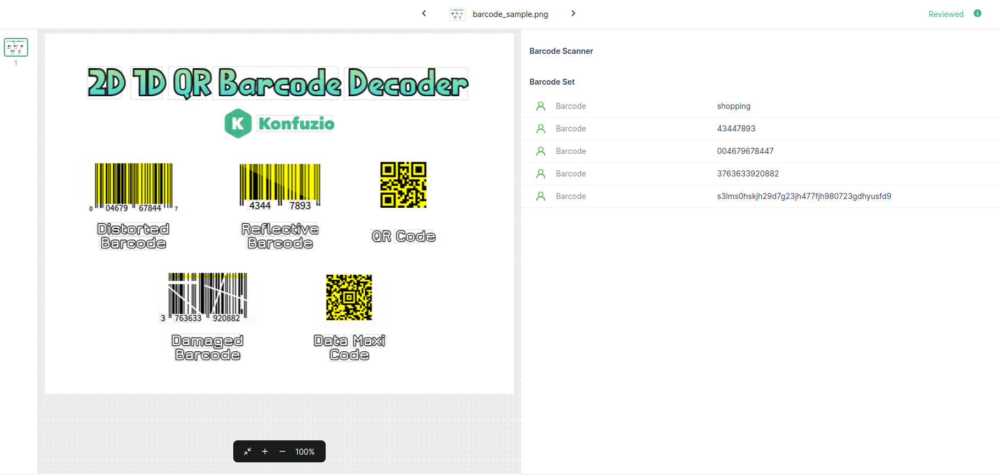
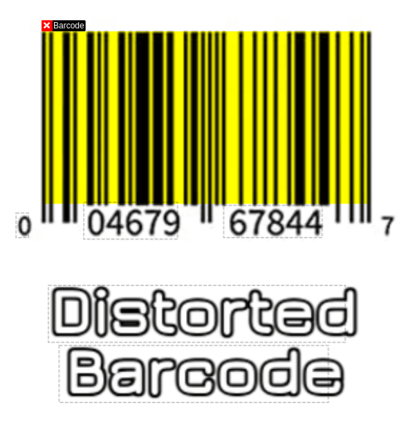

---
jupyter:
  jupytext:
    text_representation:
      extension: .md
      format_name: markdown
      format_version: '1.3'
      jupytext_version: 1.15.2
  kernelspec:
    display_name: Python 3 (ipykernel)
    language: python
    name: python3
---

## Barcode scanner

---

**Prerequisites:** 

- Data Layer concepts of Konfuzio: Project, Annotation, Document, Span, Bbox
- AI Layer concepts of Konfuzio: Information Extraction
- `zxing-cpp` installed

**Difficulty:** Medium

**Goal:** Create a custom Extraction AI that is able to extract barcodes from the Documents.

---

### Environment
You need to install the Konfuzio SDK before diving into the tutorial. \
To get up and running quickly, you can use our Colab Quick Start notebook. \
<a href="https://colab.research.google.com/github/konfuzio-ai/konfuzio-sdk/blob/master/notebooks/Quick_start_template_for_Konfuzio_SDK.ipynb" target="_parent"></a>

As an alternative you can follow the [installation section](../get_started.html#install-sdk) to install and initialize the Konfuzio SDK locally or on an environment of your choice.

### Introduction

In this tutorial, we'll walk through the creation of a Barcode Extraction AI using the `zxing-cpp` library. We'll implement a `BarcodeAnnotation` class, an Extraction AI logic, and integrate the AI with the SDK. This AI will be able to detect barcodes from Documents and generate bounding box Annotations for the detected barcodes.

The final result on the [DVUI](https://dev.konfuzio.com/dvui/index.html#what-is-the-konfuzio-document-validation-ui) would look like this:



### Setting up the BarcodeAnnotation class

The first step is to create a BarcodeAnnotation class that inherits from [Annotation](https://dev.konfuzio.com/sdk/sourcecode.html?highlight=annotation#annotation). This is needed because Annotation class is based on Spans and its Bounding Boxes are computed using these Spans.

In our case, we want to use custom Bounding Boxes that are computed using the `zxing-cpp` library, which is why we need to override the `bboxes` property of the Annotation class to return our custom Bounding Boxes. This will later be used by the Server as well as the DVUI to annotate the barcodes in the Document.

The difference between Span-based `bboxes` (dashed-line boxes) and custom `bboxes` (yellow box) is illustrated in the following image:



```python editable=true slideshow={"slide_type": ""} tags=["skip-execution", "nbval-skip"]
from typing import Dict, List
from konfuzio_sdk.data import Annotation


class BarcodeAnnotation(Annotation):
    def __init__(self, *args, **kwargs):
        super().__init__(*args, **kwargs)
        self.custom_bboxes = kwargs.get("custom_bboxes", [])

    @property
    def bboxes(self) -> List[Dict]:
        return self.custom_bboxes
```

### Define BarcodeExtractionAI class 

The second step is to create a custom [Extraction AI](https://dev.konfuzio.com/sdk/sourcecode.html#extraction-ai) class that uses the `CustomAnnotation` class. Firstly, we'll define a method to extract Bounding Boxes and barcode text from an image using the `zxing-cpp` library.
Inside this method, we loop through the results returned by `zxingcpp` and extract the raw bounding boxes, which then are transformed into Bboxes native to the Konfuzio SDK format.

```python editable=true slideshow={"slide_type": ""} tags=["skip-execution", "nbval-skip"] vscode={"languageId": "plaintext"}
def get_bboxes_from_image(self, image, page_index):
    from zxingcpp import read_barcodes

    bboxes_list = []
    barcodes_lib_results = read_barcodes(image)

    for result in barcodes_lib_results:
        position = str(result.position).rstrip("\x00")
        barcode_text_value = str(result.text).rstrip("\x00")
        top_right = position.split()[1].split("x")
        bottom_left = position.split()[-1].split("x")
        bbox_dict = self.get_bbox_dict_from_coords(
            top_right, bottom_left, page_index, image, barcode_text_value
        )
        bboxes_list.append(bbox_dict)
    return bboxes_list
```

Next, we'll implement the method to create the Bbox dictionary from the output of `zxing-cpp`. Inside this method, we use the coordinates of the Bboxes to create the Bbox dictionaries which later will be used for positioning the `CustomAnnotation` instances.

```python editable=true slideshow={"slide_type": ""} tags=["skip-execution", "nbval-skip"]
def get_bbox_dict_from_coords(
    top_right, bottom_left, page_index, image, barcode_text_value
):
    x1 = int(top_right[0])
    y1 = int(top_right[1])
    x0 = int(bottom_left[0])
    y0 = int(bottom_left[1])

    top = y1
    bottom = y0

    temp_y0 = image.height - y0
    temp_y1 = image.height - y1
    y0 = temp_y0
    y1 = temp_y1

    bbox_dict = {
        "x0": x0,
        "x1": x1,
        "y0": y0,
        "y1": y1,
        "top": top,
        "bottom": bottom,
        "page_index": page_index,
        "offset_string": barcode_text_value,
        "custom_offset_string": True,
    }
    return bbox_dict
```

In case the machine which the AI will run on does not have necessary dependencies installed, we'll implement the method to install the `zxing-cpp` library.

```python editable=true slideshow={"slide_type": ""} tags=["skip-execution", "nbval-skip"]
def install_dependencies():
    try:
        import subprocess

        package_name = "zxing-cpp"
        subprocess.check_call(["pip", "install", package_name])
        print(f"The package {package_name} is ready to be used.")
    except:
        raise Exception(
            "An error occured while installing the zxing-cpp library. Please install it manually."
        )
```

Lastly, we'll create a function that will be used to check if the Extraction AI is ready. This is needed by the server to know when to start the Extraction process.

```python editable=true slideshow={"slide_type": ""} tags=["skip-execution", "nbval-skip"]
def check_is_ready(self) -> bool:
    try:
        self.install_dependencies()
        import zxingcpp
        return True
    except:
        return False
```

For the whole code of the class, scroll down to the Conclusion.

### Save the Barcode scanner

Let's create the main script to save our Extraction AI that will be used to process Documents in Konfuzio. For that, we need to define the Project the AI will be used with and then save the Extraction AI as a compressed [pickle](https://docs.python.org/3/library/pickle.html) file that we will upload to the Server later.

```python editable=true slideshow={"slide_type": ""} tags=["skip-execution", "nbval-skip"]
from konfuzio_sdk.data import Project

project = Project(id_=project_id, update=True, strict_data_validation=False)
barcode_extraction_ai = BarcodeExtractionAI(category=project.categories[0])
pickle_model_path = barcode_extraction_ai.save()
```

This is an example of how the output of this Barcode Scanner will look like on the DVUI:


### Conclusion
In this tutorial, we have walked through the steps for building the Barcode scanner AI. Below is the full code to accomplish this task:

```python editable=true slideshow={"slide_type": ""} tags=["remove-cell"]
YOUR_PROJECT_ID = 46
```

```python editable=true slideshow={"slide_type": ""} vscode={"languageId": "plaintext"} tags=["remove-output"]
from typing import Dict, List
from konfuzio_sdk.trainer.information_extraction import AbstractExtractionAI
from konfuzio_sdk.data import Document, Category, Annotation, AnnotationSet, Project
from konfuzio_sdk.tokenizer.regex import WhitespaceTokenizer

class BarcodeAnnotation(Annotation):
    def __init__(self, *args, **kwargs):
        super().__init__(*args, **kwargs)
        self.custom_bboxes = kwargs.get("custom_bboxes", [])

    @property
    def bboxes(self) -> List[Dict]:
        return self.custom_bboxes


class BarcodeExtractionAI(AbstractExtractionAI):
    """
    A Wrapper to extract Barcodes from Documents using zxing-cpp library.
    """

    # you must set this to True if your AI requires pages images
    requires_images = True

    def __init__(self, category: Category, *args, **kwargs):
        super().__init__(category)
        self.tokenizer = WhitespaceTokenizer()

    def fit(self):
        # no training is needed since the zxing-cpp library can be used directly for extraction
        pass

    def extract(self, document: Document) -> Document:
        self.check_is_ready()
        result_document = super().extract(document)
        result_document._text = "this should be a long text or at least twice the number of barcodes in the document"
        barcode_label = self.project.get_label_by_name("Barcode")
        barcode_label_set = self.project.get_label_set_by_name("Barcodes Set")
        barcode_annotation_set = AnnotationSet(
            document=result_document, label_set=barcode_label_set
        )
        for page_index, page in enumerate(document.pages()):
            page_width = page.width
            page_height = page.height
            image = page.get_image(update=True)
            image = image.convert("RGB")
            image = image.resize((int(page_width), int(page_height)))
            page_bboxes_list = self.get_bboxes_from_image(image, page_index)
            for bbox_index, bbox_dict in enumerate(page_bboxes_list):
                _ = BarcodeAnnotation(
                    document=result_document,
                    annotation_set=barcode_annotation_set,
                    spans=[],
                    start_offset=bbox_index + 1,
                    end_offset=bbox_index + 2,
                    label=barcode_label,
                    label_set=barcode_label_set,
                    confidence=1.0,
                    bboxes=None,
                    custom_bboxes=[bbox_dict],
                )

        return result_document

    def get_bboxes_from_image(self, image, page_index):
        from zxingcpp import read_barcodes
        bboxes_list = []
        barcodes_lib_results = read_barcodes(image)
        for result in barcodes_lib_results:
            position = str(result.position).rstrip("\x00")
            barcode_text_value = str(result.text).rstrip("\x00")
            top_right = position.split()[1].split("x")
            bottom_left = position.split()[-1].split("x")
            bbox_dict = self.get_bbox_dict_from_coords(
                top_right, bottom_left, page_index, image, barcode_text_value
            )
            bboxes_list.append(bbox_dict)
        return bboxes_list

    def get_bbox_dict_from_coords(
        self, top_right, bottom_left, page_index, image, barcode_text_value
    ):
        x1 = int(top_right[0])
        y1 = int(top_right[1])
        x0 = int(bottom_left[0])
        y0 = int(bottom_left[1])
        top = y1
        bottom = y0
        temp_y0 = image.height - y0
        temp_y1 = image.height - y1
        y0 = temp_y0
        y1 = temp_y1
        bbox_dict = {
            "x0": x0,
            "x1": x1,
            "y0": y0,
            "y1": y1,
            "top": top,
            "bottom": bottom,
            "page_index": page_index,
            "offset_string": barcode_text_value,
            "custom_offset_string": True,
        }
        return bbox_dict

    def install_dependencies(self):
        try:
            import subprocess
            package_name = "zxing-cpp"
            subprocess.check_call(
                ["pip", "install", package_name])
            print(f"The package {package_name} is ready to be used.")
        except:
            raise Exception(
                "An error occured while installing the zxing-cpp library. Please install it manually."
            )

    def check_is_ready(self) -> bool:
        try:
            self.install_dependencies()
            import zxingcpp
            return True
        except:
            return False

project = Project(id_=YOUR_PROJECT_ID, strict_data_validation=False)
barcode_extraction_ai = BarcodeExtractionAI(category=project.categories[0])
pickle_model_path = barcode_extraction_ai.save()
```

### What's next?

- [Learn how to upload a custom AI](https://dev.konfuzio.com/sdk/tutorials/upload-your-ai/index.html)
- [Get to know how to create any custom Extraction AI](https://dev.konfuzio.com/sdk/tutorials/information_extraction/index.html#train-a-custom-date-extraction-ai)
