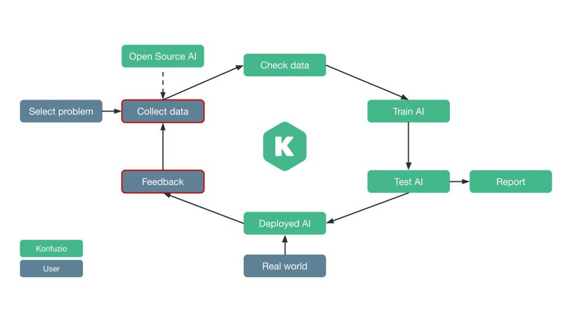

---
jupyter:
  jupytext:
    text_representation:
      extension: .md
      format_name: markdown
      format_version: '1.3'
      jupytext_version: 1.15.2
  kernelspec:
    display_name: konfuzio_sdk
    language: python
    name: python3
---

## Fine-tune Flair NER-Ontonotes-Fast with human-revised Annotations

---

**Prerequisites:**
- Data Layer concepts of Konfuzio: Project, Annotation, Document, Category
- AI Layer concepts of Konfuzio: Information Extraction
- `flair` and `nltk` installed

**Difficulty:** Hard

**Goal:** Learn how to use the results from an open-source model as Annotations in the Konfuzio Server, provide feedback to the model by accepting or rejecting them and use the revised Annotations for retraining the model, thus improving its performance.

---

### Environment
You need to install the Konfuzio SDK before diving into the tutorial. \
To get up and running quickly, you can use our Colab Quick Start notebook. \
<a href="https://colab.research.google.com/github/konfuzio-ai/konfuzio-sdk/blob/master/notebooks/Get_started_with_the_Konfuzio_SDK.ipynb" target="_parent"></a>

As an alternative you can follow the [installation section](get_started.html#install-sdk) to install and initialize the Konfuzio SDK locally or on an environment of your choice.

### Introduction

There are two main tasks that typically require human interaction with the data in the machine learning process: **data annotation** and **feedback** - the process of correcting outputs of an AI model to improve its performance in responding to your aim.
(see figure below).



In many cases, you need a custom model to solve your problem. This normally requires labeling a dataset based on your purpose and can be a very time-consuming process.

What about using an open-source model for the labeling? It may not have the domain knowledge that you desire, but you can bring it in with feedback loops, while you reduce the effort in the labeling process. Konfuzio allows this interaction - you can train the model using the Konfuzio Server and provide feedback using its SmartView/DVUI. However, if you want to use your own model and/or a machine learning pipeline but still benefit from the Konfuzio functionalities, such as the dataset hosting and labeling visualization, you can use Konfuzio SDK to connect your pipeline to Konfuzio Server in a simple and easy way.

In this tutorial, we will show how you can use the SDK to include an easy feedback workflow in your training pipeline. With these revised Annotations you can retrain your model and repeat the loop. By doing this you can reduce the effort in the labeling of the data and improve the performance of your model in the domain knowledge that you desire.

Let's start with necessary imports. In this tutorial, we will use a model from the library Flair as an example. Flair is a framework for NLP that allows to use state-of-art models for different tasks, including Named Entity Recognition. It also allows to train your own model to predict custom entities from the text.
```python tags=["skip-execution", "nbval-skip", "remove-cell"]
import sys
import logging
import subprocess
subprocess.check_call([sys.executable, '-m', 'pip', 'install', 'flair'])
logging.getLogger('konfuzio_sdk').setLevel(logging.ERROR)
YOUR_PROJECT_ID = 46
```

```python editable=true slideshow={"slide_type": ""} vscode={"languageId": "plaintext"} tags=["skip-execution", "nbval-skip"]
import nltk

from flair.models import SequenceTagger
from flair.data import Sentence
from flair.trainers import ModelTrainer
from flair.datasets import ColumnCorpus

from konfuzio_sdk.data import Project, Annotation

nltk.download('punkt')
```

Initialize the Project and load the needed Documents. If you prefer, use the example Documents in the [example folder](https://drive.google.com/drive/folders/1pjJkfIDh07bvbOp4-YOM32aOC4iGUjwW?usp=sharing). The Documents are part of the public dataset [rvl-cdip](https://www.cs.cmu.edu/~aharley/rvl-cdip/). Alternatively, you can create new Documents using your own files as described in the [tutorial](https://dev.konfuzio.com/sdk/get_started.html#upload-document).

```python editable=true slideshow={"slide_type": ""} tags=["skip-execution", "nbval-skip"]
my_project = Project(id_=YOUR_PROJECT_ID)
documents = my_project.documents
```

### Initialize the model and create Annotations

We will use a pre-trained model for Named Entity Recognition (NER) from the `flair` library. The model used is the "ner-ontonotes-fast" which is the fast version of the 18-class NER model for English from Flair. You can also your own model.

```python editable=true slideshow={"slide_type": ""} tags=["skip-execution", "nbval-skip"]
model = SequenceTagger.load('ner-ontonotes-fast')
```

Check which Labels are in the model and choose the ones that you need.

```python editable=true slideshow={"slide_type": ""} tags=["skip-execution", "nbval-skip"]
labels_available = list(set([tag.split('-')[1] for tag in model.tag_dictionary.get_items() if '-' in tag]))
```

Our example Documents are invoices. We will detect the date of the invoice and the organization which is creating it, which could be used, for example, to group the invoices per company and year. Therefore, we will use the pre-trained model to create Annotations for **dates** and **organizations** in the Documents.
The Labels for which we will create Annotations are `DATE` and `ORG`.
```python editable=true slideshow={"slide_type": ""} tags=["skip-execution", "nbval-skip"]
labels_names = ['DATE', 'ORG']
```

We need to create the Labels in the Project in accordance with the `labels_names` defined above and save their Label Sets' IDs to reuse later.

```python editable=true slideshow={"slide_type": ""} tags=["skip-execution", "nbval-skip"]
my_labels = [label for label in my_project.labels if label.name in labels_names]
my_label_sets_ids = [my_label.label_sets[0].id for my_label in my_labels]
```

Next, we define a method that publishes the resulting Annotations from the pretrained model as Annotations in the Konfuzio app.

```python editable=true slideshow={"slide_type": ""} tags=["skip-execution", "nbval-skip"]
def annotate_document(document, annotations, labels, label_sets_ids):
    labels_names = [label.name for label in labels]

    for entity in annotations:
        if entity.tag in labels_names:
            for label, label_set_id in zip(labels, label_sets_ids):
                if label.name == entity.tag:
                    break
            annotation_obj = Annotation(
                document=document,
                document_id=document.id,
                start_offset=entity.start_pos,
                end_offset=entity.end_pos,
                label=label.id,
                label_set_id=label_set_id,
                accuracy=None
            )
            _ = annotation_obj.save()
```

Iterate through your Documents to annotate them:

```python editable=true slideshow={"slide_type": ""} tags=["skip-execution", "nbval-skip"]
for doc in documents:
    sentence = Sentence(doc.text)
    model.predict(sentence)
    results = sentence.get_spans('ner')
    annotate_document(doc, results, my_labels, my_label_sets_ids)
```

After that, you will be able to view the results directly in the Document on Konfuzio app and accept or reject the Annotations. The revised Annotations then can be used to train a model on app or retrain your local model.

### Train an Extraction AI 

If you want to train a model on app, you have first to specify which Documents should be used for training.
You can do that by choosing Training in the dropdown list next to the Document's name, or in Set a status box on top of the screen, if in the SmartView mode.

Then, you have to run training (or retraining, if there have been previous instances) of the Extraction AI as described in the [tutorial](https://help.konfuzio.com/modules/extractions/index.html).

If you want to retrain your local model, you have to update your local Project first so that you get the information of the revised Annotations.

```python editable=true slideshow={"slide_type": ""} tags=["skip-execution", "nbval-skip"]
for doc in documents:
    doc.update()
```

The next step is to define which Documents should be used for training.

```python editable=true slideshow={"slide_type": ""} tags=["skip-execution", "nbval-skip"]
for doc in documents:
    doc.dataset_status = 2
    doc.save()
```

Then, use the reviewed Annotations to retrain your model. An example of how to get the data in the format necessary to retrain the flair model is shown below. The model requires the data structure to be in the BIO scheme and to be saved in a text file. In this case, to convert the Annotations to the BIO scheme, we only need to get the start and end offsets of each Annotation and its Label.
This conversion can be done using the method `get_text_in_bio_scheme()` of the Document class. We will wrap Document preprocessing into the method `create_data()` that creates data structure in the format expected by `flair` and saves it in a txt file.
Then, we separate the dataset to have training and evaluation slices and create .txt files that will be used for retraining.

This example is merely demonstrative. You might want to adapt the data structure and training parameters to your case and/or model.

```python editable=true slideshow={"slide_type": ""} tags=["skip-execution", "nbval-skip"]
def create_data(file_name, documents):
    with open(file_name, 'w') as f:
        for doc in documents:
            doc.get_text_in_bio_scheme()
            with open(doc.bio_scheme_file_path) as doc_file:
                for line in doc_file:
                    f.write(line)

# define a splitting point for the training dataset to create training and evaluation slices
n_val = max(round(len(my_project.documents) * 0.3), 1)

create_data('train.txt', my_project.documents[:-n_val])
create_data('dev.txt', my_project.documents[-n_val:])
create_data('test.txt', my_project.test_documents)
```

After converting the data to the needed format, we can retrain the tagger model loaded in the beginning. Retraining is wrapped into the `retrain()` method.

```python editable=true slideshow={"slide_type": ""} tags=["skip-execution", "nbval-skip"]
def retrain(model, data_folder='./'):
    columns = {0: 'text', 1: 'ner'}

    with open('train.txt') as train_file:
      train_file.seek(0)
      if not train_file.read(1):
        return "There is no training data. Please assign training data."
  
    corpus = ColumnCorpus(data_folder, columns, train_file='train.txt', test_file='test.txt', dev_file='dev.txt')

    model = ModelTrainer(model, corpus)
    model.train('resources/taggers/continued_model',
                learning_rate=0.01,
                mini_batch_size=32,
                max_epochs=10)

retrain(model)
```

### Conclusion

In this tutorial, we have walked through the steps for annotating Documents using the model from `flair` library and using them to train or retrain an AI for better extractions. Below is the full code to accomplish this task:

```python editable=true slideshow={"slide_type": ""} tags=["skip-execution", "nbval-skip"] vscode={"languageId": "plaintext"}
import nltk

from flair.models import SequenceTagger
from flair.data import Sentence
from flair.trainers import ModelTrainer
from flair.datasets import ColumnCorpus

from konfuzio_sdk.data import Project, Annotation

nltk.download('punkt')

my_project = Project(id_=YOUR_PROJECT_ID)
documents = my_project.documents
model = SequenceTagger.load('ner-ontonotes-fast')
labels_available = list(set([tag.split('-')[1] for tag in model.tag_dictionary.get_items() if '-' in tag]))

labels_names = ['DATE', 'ORG']

my_labels = [label for label in my_project.labels if label.name in labels_names]

my_label_sets_ids = [my_label.label_sets[0].id for my_label in my_labels]

def annotate_document(document, annotations, labels, label_sets_ids):
    labels_names = [label.name for label in labels]

    for entity in annotations:
        if entity.tag in labels_names:
            for label, label_set_id in zip(labels, label_sets_ids):
                if label.name == entity.tag:
                    break
            annotation_obj = Annotation(
                document=document,
                document_id=document.id,
                start_offset=entity.start_pos,
                end_offset=entity.end_pos,
                label=label.id,
                label_set_id=label_set_id,
                accuracy=None
            )
            _ = annotation_obj.save()

for doc in documents:
    sentence = Sentence(doc.text)
    model.predict(sentence)
    results = sentence.get_spans('ner')
    annotate_document(doc, results, my_labels, my_label_sets_ids)

for doc in documents:
  doc.update()

for doc in documents:
    doc.dataset_status = 2
    doc.save()

def create_data(file_name, documents):
    with open(file_name, 'w') as f:
        for doc in documents:
            doc.get_text_in_bio_scheme()
            with open(doc.bio_scheme_file_path) as doc_file:
                for line in doc_file:
                    f.write(line)

n_val = max(round(len(my_project.documents) * 0.3), 1)

create_data('train.txt', my_project.documents[:-n_val])
create_data('dev.txt', my_project.documents[-n_val:])
create_data('test.txt', my_project.test_documents)

def retrain(model, data_folder='./'):
    columns = {0: 'text', 1: 'ner'}

    with open('train.txt') as train_file:
      train_file.seek(0)
      if not train_file.read(1):
        return "There is no training data. Please assign a training data."
  
    corpus = ColumnCorpus(data_folder, columns, train_file='train.txt', test_file='test.txt', dev_file='dev.txt')

    model = ModelTrainer(model, corpus)
    model.train('resources/taggers/continued_model',
                learning_rate=0.01,
                mini_batch_size=32,
                max_epochs=10)

retrain(model)
```

### What's next?

- [Learn how to upload an AI created locally](https://dev.konfuzio.com/sdk/tutorials/upload-your-ai/index.html)
