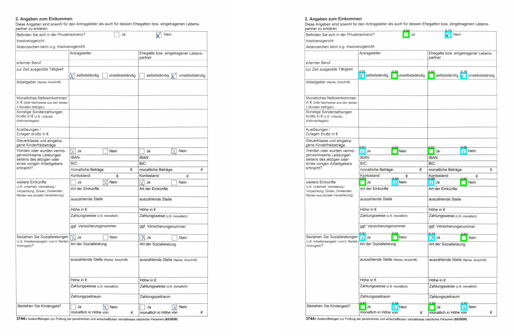
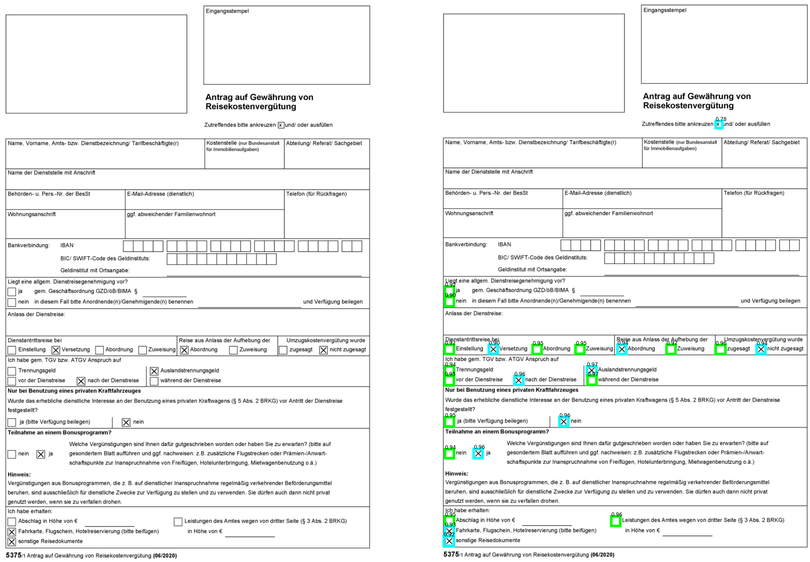

---
jupyter:
  jupytext:
    text_representation:
      extension: .md
      format_name: markdown
      format_version: '1.3'
      jupytext_version: 1.15.2
  kernelspec:
    display_name: Python 3 (ipykernel)
    language: python
    name: python3
---

## Object Detection

---

**Prerequisites:** 

- General understanding of object detection and training of neural networks.
- A COCO formatted object detection dataset.

**Difficulty:** Medium

**Goal:** Train, test and optimize an object detection model for a production use case based on a COCO formatted dataset.

---

### Environment
To get up and running quickly, you can create a new Google Colab notebook to follow along. \
<a href="https://colab.research.google.com/#create=true" target="_parent"></a>

As an alternative you can install and run the code locally or in an environment of your choice.

### Introduction

This tutorial provides a step by step guide on how to train an object detection model. 🕵 \
The focus here is on Document structures but you can use the code to train on a dataset of different domains as well. 


### Overview 🌐

We will use the state of the art object detection model [YOLO-NAS](https://konfuzio.com/de/yolo-nas-object-detection-model/). \
It was developed to incorporate high speed and accuracy, which makes it a very good fit for production use cases. For the training of the model we will use the [`super-gradients`](https://github.com/Deci-AI/super-gradients) library, which is provided by the creators of YOLO-NAS. 😎

The use case, we train the model on, is checkbox detection in form Documents. ☑ \
You can train the model for another use case, as long as you stick to the COCO dataset format.

At the end we will export the trained model, so that you can use it in another environment without the training library dependencies.

Here is an example of what the model will be capable of after training. The color cyan stands for detected checked boxes and the color green for detected empty boxes, while the number indicate the detection confidence. 😃



### Dependency installation 💿

For training and testing the model the following dependencies are needed.

```bash tags=["remove-output"]
pip install -q super-gradients
pip install -q pycocotools
pip install -q onnx
pip install -q onnxruntime
```
Due to the later export of the model into the ONNX format, the model can be tested and deployed with [ONNX Runtime](https://onnxruntime.ai/docs/) and therefore `super-gradients` and `pycocotools` dependencies are not needed for production.

### Imports 🔽

The following imports are needed to train, export and test the model.

```python tags=["remove-output"]
# General imports
from pathlib import Path
import datetime

# Data imports
from super_gradients.training.datasets.detection_datasets.coco_format_detection import COCOFormatDetectionDataset
from super_gradients.training.utils.collate_fn.crowd_detection_collate_fn import CrowdDetectionCollateFN
from super_gradients.training.transforms.transforms import DetectionMosaic, DetectionRandomAffine, DetectionHSV, \
    DetectionHorizontalFlip, DetectionVerticalFlip, DetectionPaddedRescale, DetectionStandardize, DetectionTargetsFormatTransform
from super_gradients.training import dataloaders
from super_gradients.training.datasets.datasets_utils import worker_init_reset_seed

# Training imports
from super_gradients.training import Trainer
from super_gradients.common.object_names import Models
from super_gradients.training import models
from super_gradients.training.losses import PPYoloELoss
from super_gradients.training.metrics import DetectionMetrics_050
from super_gradients.training.utils.distributed_training_utils import setup_device
from super_gradients.training.models.detection_models.pp_yolo_e import PPYoloEPostPredictionCallback

# Test and export imports
import torch
import torchvision
import onnx
import numpy as np
from PIL import Image
from onnxruntime import InferenceSession
```

### Hyperparameter setting ⚙

First we define an experiment name for the current selection of hyperparameters. This will ensure that once we iterate on different hyperparameters, that the experiments are getting saved into separate directories based on their time stamp.


```python 
# experiment name definition
t = datetime.datetime.now()
EXPERIEMENT_NAME = f"{t.year}-{t.month}-{t.day}-{t.hour}-{t.minute}-checkbox-detector"
```

We define a set of hyperparameters for the model, the training and the data. You can change them and run multiple training runs and see what works best for you. For that, it is recommended to use some model tracking tool like [wandb](https://wandb.ai/site) or [mlflow](https://mlflow.org/).
The usual input size `SIZE` for the model is `640`, which works for normally sized objects just fine. We use `1280` as input size for the detection of really small checkboxes, feel free to change it back.

```python
# Model params
MODEL_NAME = "YOLO_NAS_S"
SIZE = 1280

# Training params
WARMUP_INITIAL_LR = 5e-4
INITIAL_LR = 1e-3
COSINE_FINAL_LR_RATIO = 0.01
ZERO_WEIGHT_DECAY_ON_BIAS_AND_BN = True
LR_WARMUP_EPOCHS = 1
OPTIMIZER_WEIGHT_DECAY = 1e-4
EMA = True
EMA_DECAY = 0.9999
MAX_EPOCHS = 20
BATCH_SIZE_TRAIN = 2
BATCH_SIZE_TEST = 6
MIXED_PRECISION = True

# Data params
IGNORE_EMPTY_ANNOTATIONS = True
```

### Dataset and dataloader 🔃

We need to define on which data the model should be trained on. For this tutorial to work, the dataset needs to be formatted in the widely used [COCO format](https://cocodataset.org/#format-data).
Once you have your data ready, you need to adapt the following lines, so that the path to your dataset is defined correctly.

```python
# Base path to dataset
BASE_PATH= Path(".").absolute() # modify accordingly

# Path to specific dataset
TRAIN_FOLDER = "dataset"
TRAIN_ANNOTATION_FILE = "train.json"

TEST_FOLDER = "dataset"
TEST_ANNOTATION_FILE = "val.json"
```

Then lets convert the provided information into paths for the dataloader and check if everything is correct.

```python
# train path
train_path = BASE_PATH / TRAIN_FOLDER
train_img_path = train_path /  "images"
train_ann_path = train_path / TRAIN_ANNOTATION_FILE

# test path
test_path = BASE_PATH / TEST_FOLDER
test_img_path = test_path / "images"
test_ann_path = test_path / TEST_ANNOTATION_FILE

# checks
assert train_path.exists(), f"Train path {train_path} does not exist"
assert train_img_path.exists(), f"Train image path {train_img_path} does not exist"
assert train_ann_path.exists(), f"Train annotation path {train_ann_path} does not exist"
assert test_path.exists(), f"Train path {test_path} does not exist"
assert test_img_path.exists(), f"Train image path {test_img_path} does not exist"
assert test_ann_path.exists(), f"Train annotation path {test_ann_path} does not exist"
```

After we have the data and the path definition, we instantiate the dataset. Most important to point out here are the transforms, which contain image transformation and augmentations of the images before they are passed to the model.
We **recommend not to change** the `DetectionPaddedRescale`, `DetectionStandardize`, `DetectionTargetsFormatTransform` transforms, because the later implementation of the exported model depends on them. \
However you can of cause adapt and change the augmentation transforms  `DetectionMosaic`, `DetectionRandomAffine`, `DetectionHSV`, `DetectionHorizontalFlip`, `DetectionVerticalFlip`, according to your use case. The chosen augmentations here are meant to work for the task of object detection for Document structures, specifically checkboxes.

```python tags=["remove-output"]
# train dataset
trainset = COCOFormatDetectionDataset(data_dir=str(train_path),
                                      images_dir="",
                                      json_annotation_file=str(train_ann_path),
                                      input_dim=None,
                                      ignore_empty_annotations=IGNORE_EMPTY_ANNOTATIONS,
                                      transforms=[
                                          DetectionMosaic(prob=1., input_dim=(SIZE, SIZE)),
                                          DetectionRandomAffine(degrees=0.5, scales=(0.9, 1.1), shear=0.0,
                                                                target_size=(SIZE, SIZE),
                                                                filter_box_candidates=False, border_value=114),
                                          DetectionHSV(prob=1., hgain=1, vgain=6, sgain=6),
                                          DetectionHorizontalFlip(prob=0.5),
                                          DetectionVerticalFlip(prob=0.5),
                                          DetectionPaddedRescale(input_dim=(SIZE, SIZE)),
                                          DetectionStandardize(max_value=255),
                                          DetectionTargetsFormatTransform(input_dim=(SIZE, SIZE),
                                                                          output_format="LABEL_CXCYWH")
                                      ])

# validation dataset
valset = COCOFormatDetectionDataset(data_dir=str(test_path),
                                    images_dir="",
                                    json_annotation_file=str(test_ann_path),
                                    input_dim=None,
                                    ignore_empty_annotations=False,
                                    transforms=[
                                        DetectionPaddedRescale(input_dim=(SIZE, SIZE)),
                                        DetectionStandardize(max_value=255),
                                        DetectionTargetsFormatTransform(input_dim=(SIZE, SIZE),
                                                                        output_format="LABEL_CXCYWH")
                                    ]
                                    )
```

Based on the the dataset we infer the number of object classes the model should detect.

```python
# get number of classes from dataset
num_classes = len(trainset.classes)
```

And as a last step we instantiate the dataloader. Pay attention to the `min_samples` with value of `512`. This parameter forces the training, to use at least the `min_samples` number of images for each epoch. This is usefull for smaller datasets, as we have it for this showcase. 

```python tags=["remove-cell"]
# define train and validation loader for konfuzio testing pipeline (minimal batch size and epochs)

train_loader = dataloaders.get(dataset=trainset, dataloader_params={
    "shuffle": True,
    "batch_size": 1,
    "drop_last": False,
    "pin_memory": True,
    "collate_fn": CrowdDetectionCollateFN(),
    "worker_init_fn": worker_init_reset_seed,
    "min_samples": 1
})

valid_loader = dataloaders.get(dataset=valset, dataloader_params={
    "shuffle": False,
    "batch_size": 1,
    "num_workers": 2,
    "drop_last": False,
    "pin_memory": True,
    "collate_fn": CrowdDetectionCollateFN(),
    "worker_init_fn": worker_init_reset_seed
})

MAX_EPOCHS = 1 # overwrite for test pipeline
```

```python tags=["skip-execution", "nbval-skip"]
# train dataloader
train_loader = dataloaders.get(dataset=trainset, dataloader_params={
    "shuffle": True,
    "batch_size": BATCH_SIZE_TRAIN,
    "drop_last": False,
    "pin_memory": True,
    "collate_fn": CrowdDetectionCollateFN(),
    "worker_init_fn": worker_init_reset_seed,
    "min_samples": 512
})

#validation dataloader
valid_loader = dataloaders.get(dataset=valset, dataloader_params={
    "shuffle": False,
    "batch_size": BATCH_SIZE_TEST,
    "num_workers": 2,
    "drop_last": False,
    "pin_memory": True,
    "collate_fn": CrowdDetectionCollateFN(),
    "worker_init_fn": worker_init_reset_seed
})
```

### Training 🏋

Now we prepare the model and training parameters based on the hyperparameters we have chosen previously.

```python
# training parameter definition for trainer
train_params = {
  "warmup_initial_lr": WARMUP_INITIAL_LR,
  "initial_lr": INITIAL_LR,
  "lr_mode": "cosine",
  "cosine_final_lr_ratio": COSINE_FINAL_LR_RATIO,
  "optimizer": "AdamW",
  "zero_weight_decay_on_bias_and_bn": ZERO_WEIGHT_DECAY_ON_BIAS_AND_BN,
  "lr_warmup_epochs": LR_WARMUP_EPOCHS,
  "warmup_mode": "linear_epoch_step",
  "optimizer_params": {"weight_decay": OPTIMIZER_WEIGHT_DECAY},
  "ema": EMA,
  "ema_params": {"decay": EMA_DECAY, "decay_type": "threshold"},
  "max_epochs": MAX_EPOCHS,
  "mixed_precision": MIXED_PRECISION,
  "loss": PPYoloELoss(use_static_assigner=False, num_classes=num_classes, reg_max=16),
  "valid_metrics_list": [
      DetectionMetrics_050(score_thres=0.1, num_cls=num_classes, normalize_targets=True,
                            post_prediction_callback=PPYoloEPostPredictionCallback(score_threshold=0.01,
                                                                                  nms_top_k=1000,
                                                                                  max_predictions=300,
                                                                                  nms_threshold=0.7))],
  "metric_to_watch": 'F1@0.50',
  }
```

Definition which model type should be used.

```python
# model selection
if MODEL_NAME=="YOLO_NAS_S":
  model = Models.YOLO_NAS_S
elif MODEL_NAME=="YOLO_NAS_M":
  model = Models.YOLO_NAS_M
elif MODEL_NAME=="YOLO_NAS_L":
  model = Models.YOLO_NAS_L
```

Define what device should be used for training. 

```python tags=["remove-cell"]
# select cpu as device for konfuzio test pipeline
setup_device(device="cpu", num_gpus = 0)
```

```python tags=["skip-execution", "nbval-skip"]
# device selection
setup_device(device="cuda")
```

> **Tip** 👍  \
> Use a GPU for training, processing on CPU will be prohibitively expensive.


Now we are all set and ready for training! 🚀 \
So let's define the trainer, the model and start training..

```python tags=["remove-output"]
# define trainer
trainer = Trainer(experiment_name=EXPERIEMENT_NAME, ckpt_root_dir="./checkpoints_dir")

# define model
yolo_model = models.get(model, num_classes=num_classes, pretrained_weights=None)

# start training
trainer.train(model=yolo_model, training_params=train_params, train_loader=train_loader, valid_loader=valid_loader)
```

> **Important**❗ \
> If you want to use the model commercially, you need to ensure that the model for training is not initialized with pretrained weights from `super-gradients`. This is the case if you set `pretrained_weights=None` during instantiation of the super-gradients model.


### Export and saving ➡

After the training has finished, we want to export the saved model into the ONNX format, mainly to be independent of the training library and so that we have our model in a universal format which can be deployed on different platforms easily.

For that we first set some general parameters like batch size during production and which model we want to use (`latest`, `best`).

```python
# export parameters
BATCH_SIZE = 1
CHANNELS = 3
WEIGHTS_FILE = "ckpt_best.pth"
EXPORT_NAME = "yolo_model.onnx"
```

Then we get the path to the checkpoint, which was saved during training.

```python
# get path to trained model
checkpoint_dir = Path(trainer.sg_logger._local_dir)
checkpoint_path = checkpoint_dir / WEIGHTS_FILE
assert checkpoint_path.exists(), f"No checkpoint file found in {checkpoint_path}. Check if the train run was successful."
```

Now we can load and export the model to ONNX.

```python tags=["remove-output"]
# load the trained model
yolo_model = models.get(model, num_classes=num_classes, checkpoint_path=str(checkpoint_path))
yolo_model.to(trainer.device)

# define dummy input
dummy_input = torch.randn(
    BATCH_SIZE, CHANNELS, SIZE, SIZE, device=trainer.device
)

# define input and output names
input_names = ["input"]
output_names = ["output"]

# export the model to onnx format
torch.onnx.export(
    yolo_model,
    dummy_input,
    EXPORT_NAME,
    verbose=True,
    input_names=input_names,
    output_names=output_names,
)
assert Path(EXPORT_NAME).exists(), "\nModel export was not successful.\n"

# check the onnx model
model_onnx = onnx.load(EXPORT_NAME)
onnx.checker.check_model(model_onnx)

print("\nModel exported to ONNX format.\n")
```


### Load and test 🏁

To use the model in the onnx format without `super-gradients` we need to define the pre-processing, especially the transforms used during training, the model session and the post-processing like thresholding and non-maximum-suppression ourselves. This is not needed for testing and experimenting with the model but comes in handy for using the model in production, due to less dependencies, more control as well as optimization in model size and runtime.

```python
class Detector:
    """Detect checkboxes in images using a pre-trained model."""
    def __init__(self, onnx_path, input_shape, num_classes, threshold=0.7):
        """Initialize the CheckboxDetector with a pre-trained model and default parameter."""
        self.session = InferenceSession(onnx_path)
        self.input_shape = input_shape
        self.threshold = threshold
        self.num_classes = num_classes  

    def __call__(self, image):
        """Run model inference and pre/post processing."""
        input_image = self._preprocess(image)
        outputs = self.session.run(None, {"input": input_image})
        cls_conf, bboxes = self._postprocess(outputs, image.size)
        return cls_conf, bboxes

    def _threshold(self, cls_conf, bboxes):
        """Filter detections based on confidence threshold."""
        idx = np.argwhere(cls_conf > self.threshold)
        cls_conf = cls_conf[idx[:, 0]]
        bboxes = bboxes[idx[:, 0]]
        return cls_conf, bboxes

    def _nms(self, cls_conf, bboxes):
        """Apply Non-Maximum-Suppression to detections."""
        indices = torchvision.ops.nms(
            torch.from_numpy(bboxes),
            torch.from_numpy(cls_conf.max(1)),
            iou_threshold=0.5,
        ).numpy()
        cls_conf = cls_conf[indices]
        bboxes = bboxes[indices]
        return cls_conf, bboxes

    def _rescale(self, image, output_shape):
        """Rescale image to a specified output shape."""
        height, width = image.shape[:2]
        scale_factor = min(output_shape[0] / height, output_shape[1] / width)
        if scale_factor != 1.0:
            new_height, new_width = (
                round(height * scale_factor),
                round(width * scale_factor),
            )
            image = Image.fromarray(image)
            image = image.resize((new_width, new_height), Image.LANCZOS)
            image = np.array(image)
        return image

    def _bottom_right_pad(self, image, output_shape, pad_value = (114, 114, 114)):
        """Pad image on the bottom and right to reach the output shape."""
        height, width = image.shape[:2]
        pad_height = output_shape[0] - height
        pad_width = output_shape[1] - width

        pad_h = (0, pad_height)  # top=0, bottom=pad_height
        pad_w = (0, pad_width)  # left=0, right=pad_width

        constant_values = ((pad_value, pad_value), (pad_value, pad_value), (0, 0))
        constant_values = np.array(constant_values, dtype=np.object_)

        padding_values = (pad_h, pad_w, (0, 0))
        processed_image = np.pad(
            image,
            pad_width=padding_values,
            mode="constant",
            constant_values=constant_values,
        )

        return processed_image

    def _permute(self, image, permutation = (2, 0, 1)):
        """Permute the image channels."""
        processed_image = np.ascontiguousarray(image.transpose(permutation))
        return processed_image

    def _standardize(self, image, max_value=255):
        """Standardize the pixel values of image."""
        processed_image = (image / max_value).astype(np.float32)
        return processed_image

    def _preprocess(self, image):
        """Preprocesses image with all transforms as during training before passing it to the model."""
        if image.mode == "P":
            image = image.convert("RGB")
        image = np.array(image)[
            :, :, ::-1
        ]  # convert to np and BGR as during training
        image = self._rescale(image, output_shape=self.input_shape)
        image = self._bottom_right_pad(
            image, output_shape=self.input_shape, pad_value=(114, 114, 114)
        )
        image = self._permute(image, permutation=(2, 0, 1))
        image = self._standardize(image, max_value=255)
        image = image[np.newaxis, ...]  # add batch dimension
        return image

    def _postprocess(self, outputs, image_shape):
        """Postprocesses the model's outputs to obtain final detections."""
        bboxes = outputs[0][0,:,:]
        cls_conf = outputs[1][0,:,:]
        cls_conf, bboxes = self._threshold(cls_conf, bboxes)

        if len(cls_conf) > 1:
            cls_conf, bboxes = self._nms(cls_conf, bboxes)
        #Define and apply scale for the bounding boxes to the original image size
        scaler = max(
            (
                image_shape[1] / self.input_shape[1],
                image_shape[0] / self.input_shape[0],
            )
        )
        bboxes *= scaler
        bboxes = np.array(
            [(int(b[0]), int(b[1]), int(b[2]), int(b[3])) for b in bboxes]
        )
        return cls_conf, bboxes
```

Now we can instantiate a new model/detector based on the above class and the saved onnx model. 🤖

```python
# instantiate detector
detector = Detector(onnx_path=EXPORT_NAME, input_shape=(SIZE,SIZE), num_classes=num_classes, threshold=0.7)
```

To test the checkbox detector we first load an image. 🖼

```python
#load test image
sample_img_path = Path("./test_image.png")
assert sample_img_path.exists(), f"Image file with path {sample_img_path} not found."
sample_img = Image.open(str(sample_img_path), mode='r')
```

Then we run inference and apply some pre-processing for the visualization. 🎯

```python
# run inference
cls_conf, bboxes = detector(sample_img)
checked = [True if c[0] > c[1] else False for c in cls_conf]
score = cls_conf.max(1)
```

The used visualization function is as follows. 

```python
# vizualization
import matplotlib.pyplot as plt
import copy
%matplotlib inline
import matplotlib as mpl
from PIL import Image, ImageDraw
mpl.rcParams['figure.dpi']= 600

colors = [(0,1,0), (0,1,1)]
colorst = [(1,1,0), (1,0,1)]

def plot_results(pil_img, scores, labels, boxes, name=None):
    plt.figure(figsize=(2,1))
    fig, ax = plt.subplots(1,2)
    ax[0].axis('off')
    ax[0].imshow(copy.deepcopy(pil_img))
    for score, label, (xmin, ymin, xmax, ymax) in zip(scores, labels, boxes):
        ax[1].add_patch(plt.Rectangle((xmin, ymin), xmax - xmin, ymax - ymin,
                                   fill=False, color=colors[int(label)], linewidth=1))
        text = f'{score:0.2f}'
        ax[1].text(xmin, ymin, text, fontsize=2,
                bbox=dict(alpha=0.0))

    ax[1].axis('off')
    ax[1].imshow(pil_img)

    fig.show()
    fig.savefig(f'{name}')
```

Finally we run the visualization based on the detectors output. 😃
```python
# show result
plot_results(sample_img, score, checked, bboxes, "Example of checkbox detection")
```




### Conclusion 💭
In this tutorial, we have trained, optimized and tested the object detection model YOLO-NAS on a coco dataset. Below is the full code to accomplish this task:

**Dependency installation**
```bash tags=["skip-execution", "nbval-skip"]
pip install -q super-gradients
pip install -q pycocotools
pip install -q onnx
pip install -q onnxruntime
```

```python tags=["skip-execution", "nbval-skip"]
# General imports
from pathlib import Path
import datetime

# Data imports
from super_gradients.training.datasets.detection_datasets.coco_format_detection import COCOFormatDetectionDataset
from super_gradients.training.utils.collate_fn.crowd_detection_collate_fn import CrowdDetectionCollateFN
from super_gradients.training.transforms.transforms import DetectionMosaic, DetectionRandomAffine, DetectionHSV, \
    DetectionHorizontalFlip, DetectionVerticalFlip, DetectionPaddedRescale, DetectionStandardize, DetectionTargetsFormatTransform
from super_gradients.training import dataloaders
from super_gradients.training.datasets.datasets_utils import worker_init_reset_seed

# Training imports
from super_gradients.training import Trainer
from super_gradients.common.object_names import Models
from super_gradients.training import models
from super_gradients.training.losses import PPYoloELoss
from super_gradients.training.metrics import DetectionMetrics_050
from super_gradients.training.utils.distributed_training_utils import setup_device
from super_gradients.training.models.detection_models.pp_yolo_e import PPYoloEPostPredictionCallback

# Test and export imports
import torch
import torchvision
import onnx
import numpy as np
from PIL import Image
from onnxruntime import InferenceSession

# experiment name definition
t = datetime.datetime.now()
EXPERIEMENT_NAME = f"{t.year}-{t.month}-{t.day}-{t.hour}-{t.minute}-checkbox-detector"

# Model params
MODEL_NAME = "YOLO_NAS_S"
SIZE = 1280

# Training params
WARMUP_INITIAL_LR = 5e-4
INITIAL_LR = 1e-3
COSINE_FINAL_LR_RATIO = 0.01
ZERO_WEIGHT_DECAY_ON_BIAS_AND_BN = True
LR_WARMUP_EPOCHS = 1
OPTIMIZER_WEIGHT_DECAY = 1e-4
EMA = True
EMA_DECAY = 0.9999
MAX_EPOCHS = 20
BATCH_SIZE_TRAIN = 2
BATCH_SIZE_TEST = 6
MIXED_PRECISION = True

# Data params
IGNORE_EMPTY_ANNOTATIONS = True

# Base path to dataset
BASE_PATH= Path(".").absolute() # modify accordingly

# Path to specific dataset
TRAIN_FOLDER = "dataset"
TRAIN_ANNOTATION_FILE = "train.json"

TEST_FOLDER = "dataset"
TEST_ANNOTATION_FILE = "val.json"

# train path
train_path = BASE_PATH / TRAIN_FOLDER
train_img_path = train_path /  "images"
train_ann_path = train_path / TRAIN_ANNOTATION_FILE

# test path
test_path = BASE_PATH / TEST_FOLDER
test_img_path = test_path / "images"
test_ann_path = test_path / TEST_ANNOTATION_FILE

# checks
assert train_path.exists(), f"Train path {train_path} does not exist"
assert train_img_path.exists(), f"Train image path {train_img_path} does not exist"
assert train_ann_path.exists(), f"Train annotation path {train_ann_path} does not exist"
assert test_path.exists(), f"Train path {test_path} does not exist"
assert test_img_path.exists(), f"Train image path {test_img_path} does not exist"
assert test_ann_path.exists(), f"Train annotation path {test_ann_path} does not exist"

# train dataset
trainset = COCOFormatDetectionDataset(data_dir=str(train_path),
                                      images_dir="",
                                      json_annotation_file=str(train_ann_path),
                                      input_dim=None,
                                      ignore_empty_annotations=IGNORE_EMPTY_ANNOTATIONS,
                                      transforms=[
                                          DetectionMosaic(prob=1., input_dim=(SIZE, SIZE)),
                                          DetectionRandomAffine(degrees=0.5, scales=(0.9, 1.1), shear=0.0,
                                                                target_size=(SIZE, SIZE),
                                                                filter_box_candidates=False, border_value=114),
                                          DetectionHSV(prob=1., hgain=1, vgain=6, sgain=6),
                                          DetectionHorizontalFlip(prob=0.5),
                                          DetectionVerticalFlip(prob=0.5),
                                          DetectionPaddedRescale(input_dim=(SIZE, SIZE)),
                                          DetectionStandardize(max_value=255),
                                          DetectionTargetsFormatTransform(input_dim=(SIZE, SIZE),
                                                                          output_format="LABEL_CXCYWH")
                                      ])

# validation dataset
valset = COCOFormatDetectionDataset(data_dir=str(test_path),
                                    images_dir="",
                                    json_annotation_file=str(test_ann_path),
                                    input_dim=None,
                                    ignore_empty_annotations=False,
                                    transforms=[
                                        DetectionPaddedRescale(input_dim=(SIZE, SIZE)),
                                        DetectionStandardize(max_value=255),
                                        DetectionTargetsFormatTransform(input_dim=(SIZE, SIZE),
                                                                        output_format="LABEL_CXCYWH")
                                    ]
                                    )

# get number of classes from dataset
num_classes = len(trainset.classes)

# train dataloader
train_loader = dataloaders.get(dataset=trainset, dataloader_params={
    "shuffle": True,
    "batch_size": BATCH_SIZE_TRAIN,
    "drop_last": False,
    "pin_memory": True,
    "collate_fn": CrowdDetectionCollateFN(),
    "worker_init_fn": worker_init_reset_seed,
    "min_samples": 512
})

#validation dataloader
valid_loader = dataloaders.get(dataset=valset, dataloader_params={
    "shuffle": False,
    "batch_size": BATCH_SIZE_TEST,
    "num_workers": 2,
    "drop_last": False,
    "pin_memory": True,
    "collate_fn": CrowdDetectionCollateFN(),
    "worker_init_fn": worker_init_reset_seed
})

# training parameter definition for trainer
train_params = {
  "warmup_initial_lr": WARMUP_INITIAL_LR,
  "initial_lr": INITIAL_LR,
  "lr_mode": "cosine",
  "cosine_final_lr_ratio": COSINE_FINAL_LR_RATIO,
  "optimizer": "AdamW",
  "zero_weight_decay_on_bias_and_bn": ZERO_WEIGHT_DECAY_ON_BIAS_AND_BN,
  "lr_warmup_epochs": LR_WARMUP_EPOCHS,
  "warmup_mode": "linear_epoch_step",
  "optimizer_params": {"weight_decay": OPTIMIZER_WEIGHT_DECAY},
  "ema": EMA,
  "ema_params": {"decay": EMA_DECAY, "decay_type": "threshold"},
  "max_epochs": MAX_EPOCHS,
  "mixed_precision": MIXED_PRECISION,
  "loss": PPYoloELoss(use_static_assigner=False, num_classes=num_classes, reg_max=16),
  "valid_metrics_list": [
      DetectionMetrics_050(score_thres=0.1, num_cls=num_classes, normalize_targets=True,
                            post_prediction_callback=PPYoloEPostPredictionCallback(score_threshold=0.01,
                                                                                  nms_top_k=1000,
                                                                                  max_predictions=300,
                                                                                  nms_threshold=0.7))],
  "metric_to_watch": 'F1@0.50',
  }

# model selection
if MODEL_NAME=="YOLO_NAS_S":
  model = Models.YOLO_NAS_S
elif MODEL_NAME=="YOLO_NAS_M":
  model = Models.YOLO_NAS_M
elif MODEL_NAME=="YOLO_NAS_L":
  model = Models.YOLO_NAS_L

# device selection
setup_device(device="cuda")

# define trainer
trainer = Trainer(experiment_name=EXPERIEMENT_NAME, ckpt_root_dir="./checkpoints_dir")

# define model
yolo_model = models.get(model, num_classes=num_classes, pretrained_weights=None)

# start training
trainer.train(model=yolo_model, training_params=train_params, train_loader=train_loader, valid_loader=valid_loader)

# export parameters
BATCH_SIZE = 1
CHANNELS = 3
WEIGHTS_FILE = "ckpt_best.pth"
EXPORT_NAME = "yolo_model.onnx"

# get path to trained model
checkpoint_dir = Path(trainer.sg_logger._local_dir)
checkpoint_path = checkpoint_dir / WEIGHTS_FILE
assert checkpoint_path.exists(), f"No checkpoint file found in {checkpoint_path}. Check if the train run was successful."

# load the trained model
yolo_model = models.get(model, num_classes=num_classes, checkpoint_path=str(checkpoint_path))
yolo_model.to(trainer.device)

# define dummy input
dummy_input = torch.randn(
    BATCH_SIZE, CHANNELS, SIZE, SIZE, device=trainer.device
)

# define input and output names
input_names = ["input"]
output_names = ["output"]

# export the model to onnx format
torch.onnx.export(
    yolo_model,
    dummy_input,
    EXPORT_NAME,
    verbose=True,
    input_names=input_names,
    output_names=output_names,
)
assert Path(EXPORT_NAME).exists(), "\nModel export was not successful.\n"

# check the onnx model
model_onnx = onnx.load(EXPORT_NAME)
onnx.checker.check_model(model_onnx)

print("\nModel exported to ONNX format.\n")

class Detector:
    """Detect checkboxes in images using a pre-trained model."""
    def __init__(self, onnx_path, input_shape, num_classes, threshold=0.7):
        """Initialize the CheckboxDetector with a pre-trained model and default parameter."""
        self.session = InferenceSession(onnx_path)
        self.input_shape = input_shape
        self.threshold = threshold
        self.num_classes = num_classes  

    def __call__(self, image):
        """Run model inference and pre/post processing."""
        input_image = self._preprocess(image)
        outputs = self.session.run(None, {"input": input_image})
        cls_conf, bboxes = self._postprocess(outputs, image.size)
        return cls_conf, bboxes

    def _threshold(self, cls_conf, bboxes):
        """Filter detections based on confidence threshold."""
        idx = np.argwhere(cls_conf > self.threshold)
        cls_conf = cls_conf[idx[:, 0]]
        bboxes = bboxes[idx[:, 0]]
        return cls_conf, bboxes

    def _nms(self, cls_conf, bboxes):
        """Apply Non-Maximum-Suppression to detections."""
        indices = torchvision.ops.nms(
            torch.from_numpy(bboxes),
            torch.from_numpy(cls_conf.max(1)),
            iou_threshold=0.5,
        ).numpy()
        cls_conf = cls_conf[indices]
        bboxes = bboxes[indices]
        return cls_conf, bboxes

    def _rescale(self, image, output_shape):
        """Rescale image to a specified output shape."""
        height, width = image.shape[:2]
        scale_factor = min(output_shape[0] / height, output_shape[1] / width)
        if scale_factor != 1.0:
            new_height, new_width = (
                round(height * scale_factor),
                round(width * scale_factor),
            )
            image = Image.fromarray(image)
            image = image.resize((new_width, new_height), Image.LANCZOS)
            image = np.array(image)
        return image

    def _bottom_right_pad(self, image, output_shape, pad_value = (114, 114, 114)):
        """Pad image on the bottom and right to reach the output shape."""
        height, width = image.shape[:2]
        pad_height = output_shape[0] - height
        pad_width = output_shape[1] - width

        pad_h = (0, pad_height)  # top=0, bottom=pad_height
        pad_w = (0, pad_width)  # left=0, right=pad_width

        constant_values = ((pad_value, pad_value), (pad_value, pad_value), (0, 0))
        constant_values = np.array(constant_values, dtype=np.object_)

        padding_values = (pad_h, pad_w, (0, 0))
        processed_image = np.pad(
            image,
            pad_width=padding_values,
            mode="constant",
            constant_values=constant_values,
        )

        return processed_image

    def _permute(self, image, permutation = (2, 0, 1)):
        """Permute the image channels."""
        processed_image = np.ascontiguousarray(image.transpose(permutation))
        return processed_image

    def _standardize(self, image, max_value=255):
        """Standardize the pixel values of image."""
        processed_image = (image / max_value).astype(np.float32)
        return processed_image

    def _preprocess(self, image):
        """Preprocesses image with all transforms as during training before passing it to the model."""
        if image.mode == "P":
            image = image.convert("RGB")
        image = np.array(image)[
            :, :, ::-1
        ]  # convert to np and BGR as during training
        image = self._rescale(image, output_shape=self.input_shape)
        image = self._bottom_right_pad(
            image, output_shape=self.input_shape, pad_value=(114, 114, 114)
        )
        image = self._permute(image, permutation=(2, 0, 1))
        image = self._standardize(image, max_value=255)
        image = image[np.newaxis, ...]  # add batch dimension
        return image

    def _postprocess(self, outputs, image_shape):
        """Postprocesses the model's outputs to obtain final detections."""
        bboxes = outputs[0][0,:,:]
        cls_conf = outputs[1][0,:,:]
        cls_conf, bboxes = self._threshold(cls_conf, bboxes)

        if len(cls_conf) > 1:
            cls_conf, bboxes = self._nms(cls_conf, bboxes)
        #Define and apply scale for the bounding boxes to the original image size
        scaler = max(
            (
                image_shape[1] / self.input_shape[1],
                image_shape[0] / self.input_shape[0],
            )
        )
        bboxes *= scaler
        bboxes = np.array(
            [(int(b[0]), int(b[1]), int(b[2]), int(b[3])) for b in bboxes]
        )
        return cls_conf, bboxes

# instantiate detector
detector = Detector(onnx_path=EXPORT_NAME, input_shape=(SIZE,SIZE), num_classes=num_classes, threshold=0.7)

#load test image
sample_img_path = Path("./test_image.png")
assert sample_img_path.exists(), f"Image file with path {sample_img_path} not found."
sample_img = Image.open(str(sample_img_path), mode='r')

# run inference
cls_conf, bboxes = detector(sample_img)
checked = [True if c[0] > c[1] else False for c in cls_conf]
score = cls_conf.max(1)

# vizualization
import matplotlib.pyplot as plt
import copy
%matplotlib inline
import matplotlib as mpl
from PIL import Image, ImageDraw
mpl.rcParams['figure.dpi']= 600

colors = [(0,1,0), (0,1,1)]
colorst = [(1,1,0), (1,0,1)]

def plot_results(pil_img, scores, labels, boxes, name=None):
    plt.figure(figsize=(2,1))
    fig, ax = plt.subplots(1,2)
    ax[0].axis('off')
    ax[0].imshow(copy.deepcopy(pil_img))
    for score, label, (xmin, ymin, xmax, ymax) in zip(scores, labels, boxes):
        ax[1].add_patch(plt.Rectangle((xmin, ymin), xmax - xmin, ymax - ymin,
                                   fill=False, color=colors[int(label)], linewidth=1))
        text = f'{score:0.2f}'
        ax[1].text(xmin, ymin, text, fontsize=2,
                bbox=dict(alpha=0.0))

    ax[1].axis('off')
    ax[1].imshow(pil_img)

    fig.show()
    fig.savefig(f'{name}')

# show result
plot_results(sample_img, score, checked, bboxes, "Example of checkbox detection")
```

### What's next? ⏭

- [Learn how to upload a custom AI](https://dev.konfuzio.com/sdk/tutorials/upload-your-ai/index.html)
- [Get to know how to create any custom Extraction AI](https://dev.konfuzio.com/sdk/tutorials/information_extraction/index.html#train-a-custom-date-extraction-ai)
