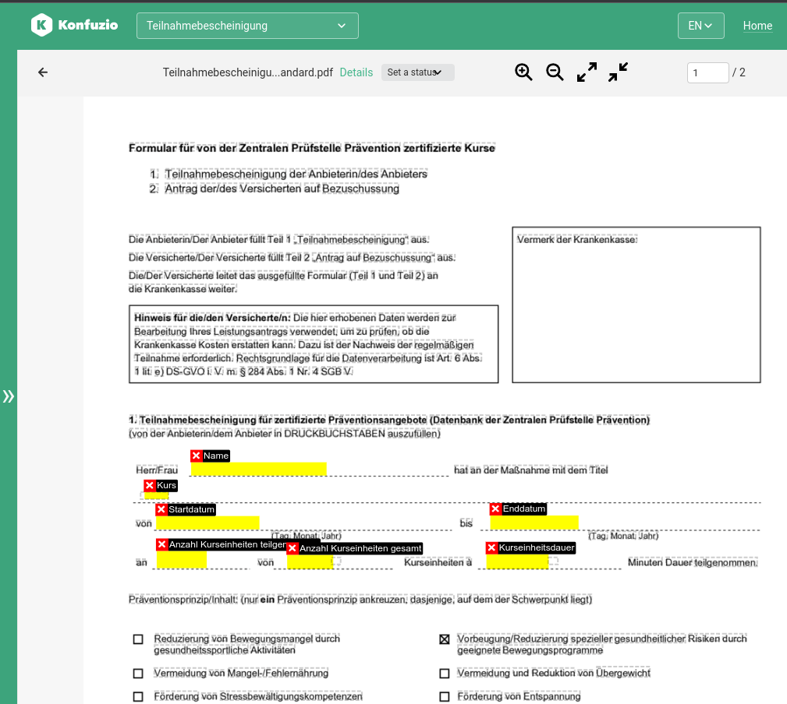
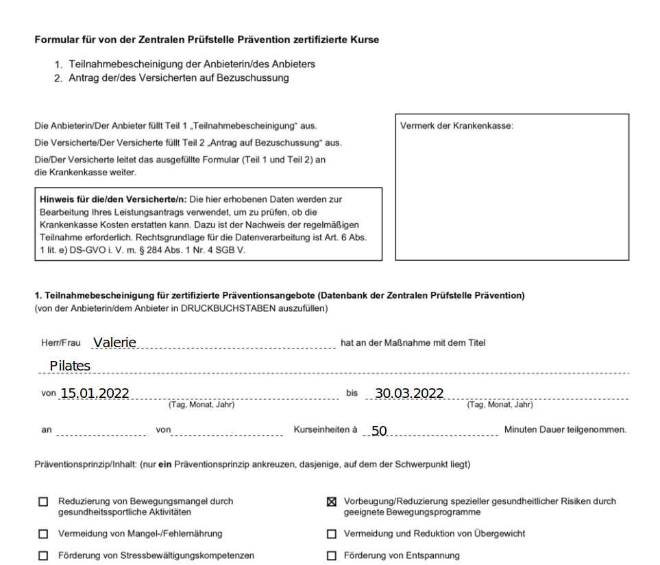

---
jupyter:
  jupytext:
    text_representation:
      extension: .md
      format_name: markdown
      format_version: '1.3'
      jupytext_version: 1.15.2
  kernelspec:
    display_name: Python 3 (ipykernel)
    language: python
    name: python3
---

## Build your own PDF form generator

---

**Prerequisites:**

- Data Layer concepts of Konfuzio: Project, Document, Annotation, Page
- PyPDF2 and reportlab installed

**Difficulty:** Medium

**Goal:** Learn how to create a generator to fill in the fields of PDF forms using Konfuzio SDK, reportlab and PyPDF2.

---

### Introduction

If you have an empty form (or a set of them) and data that has to go into this form, you can automate this process using reportlab's ability to visualize text objects and Konfuzio SDK's ability to store information about entities and their positions inside the Document's Pages. 

To begin with, you need to upload the empty form you would like to process and create empty Annotations in the fields where you want to insert the text.



Then, let's initialize a Project and a Document that was created from an uploaded form.

```python editable=true slideshow={"slide_type": ""} tags=["skip-execution", "nbval-skip"]
import io

from PyPDF2 import PdfFileWriter, PdfFileReader
from reportlab.pdfgen import canvas
from reportlab.lib import colors

from konfuzio_sdk.data import Project, Document, Page, Annotation

my_project = Project(id_=YOUR_PROJECT_ID, update=True)
document = my_project.get_document_by_id(YOUR_DOCUMENT_ID)
```

Create pairs of Labels and texts which will appear in now-empty fields.

```python editable=true slideshow={"slide_type": ""} tags=["skip-execution", "nbval-skip"]
values = {'Name': 'Valerie', 'Kurs': 'Pilates', 'Startdatum': '15.01.2022', 'Enddatum': '30.03.2022', 'Kursenheitsdauer': '50'}
```

Iterate over the Document's Pages and empty Annotations in them, adding text objects into the Bounding Boxes of these Annotations via reportlab.

```python editable=true slideshow={"slide_type": ""} tags=["nbval-skip", "skip-execution"]
for page_index, page in enumerate(document.pages()):
    packet = io.BytesIO()
    my_canvas = canvas.Canvas(packet)
    my_canvas.setPageSize((page.width, page.height))
    for annotation: Annotation in document.annotations():
        if annotation.selection_bbox.get('page_index') == page_index:
            text_value = values.get(annotation.label.name, '')
            textobject = my_canvas.beginText()
            textobject.setTextOrigin(annotation.x0, annotation.y0)
            textobject.setFillColor(colors.black)
            textobject.textLine(text=text_value)
            my_canvas.drawText(textobject)
    my_canvas.save()
    packet.seek(0)
    new_pdf = PdfFileReader(packet)
    page = existing_pdf.getPage(page_index)
    page.mergePage(new_pdf.getPage(0))
    output.addPage(page)
```

Write the output to a new file:

```python editable=true slideshow={"slide_type": ""} tags=["skip-execution", "nbval-skip"]
outputStream = open(f"{document.id_}.pdf", "wb")
output.write(outputStream)
outputStream.close()
```

The resulting form will look like this:



### Conclusion
In this tutorial, we have walked through the steps for automatization of PDF form filling. Below is the full code to accomplish this task; part of the code has been wrapped into the method `render()`.

```python editable=true slideshow={"slide_type": ""} tags=["skip-execution", "nbval-skip"] vscode={"languageId": "plaintext"}
import io

from PyPDF2 import PdfFileWriter, PdfFileReader
from reportlab.pdfgen import canvas
from reportlab.lib import colors

from konfuzio_sdk.data import Project, Document

def render(document_id, project_id, values):
    my_project = Project(id_=project_id, update=True)
    document: Document = my_project.get_document_by_id(document_id)

    existing_pdf = PdfFileReader(open(document.get_file(), "rb"))
    output = PdfFileWriter()

    for page_index, page in enumerate(document.pages()):
        packet = io.BytesIO()
        my_canvas = canvas.Canvas(packet)
        my_canvas.setPageSize((page.width, page.height))
        for annotation in document.annotations():
            if annotation.selection_bbox.get('page_index') == page_index:
                text_value = values.get(annotation.label.name, '')
                textobject = my_canvas.beginText()
                textobject.setTextOrigin(annotation.x0, annotation.y0)
                textobject.setFillColor(colors.black)
                textobject.textLine(text=text_value)
                my_canvas.drawText(textobject)
        my_canvas.save()

        packet.seek(0)

        new_pdf = PdfFileReader(packet)

        page = existing_pdf.getPage(page_index)
        page.mergePage(new_pdf.getPage(0))
        output.addPage(page)

    return output

values = {'Label1': 'Value1', 'Label2': 'Value2', 'Label3': 'Value3'}

project_id = YOUR_PROJECT_ID
document_id = YOUR_DOCUMENT_ID

output = render(document_id=document_id, project_id=project_id, values=values)

outputStream = open(f"{document_id}.pdf", "wb")
output.write(outputStream)
outputStream.close()
```

### What's next?

- [Find out how to create Annotations based on Regular Expressions](https://dev.konfuzio.com/sdk/tutorials/regex_based_annotations/index.html)
- [Learn how to visualize Bounding Boxes of a Document's Annotations](https://dev.konfuzio.com//sdk/explanations.html#coordinates-system)
