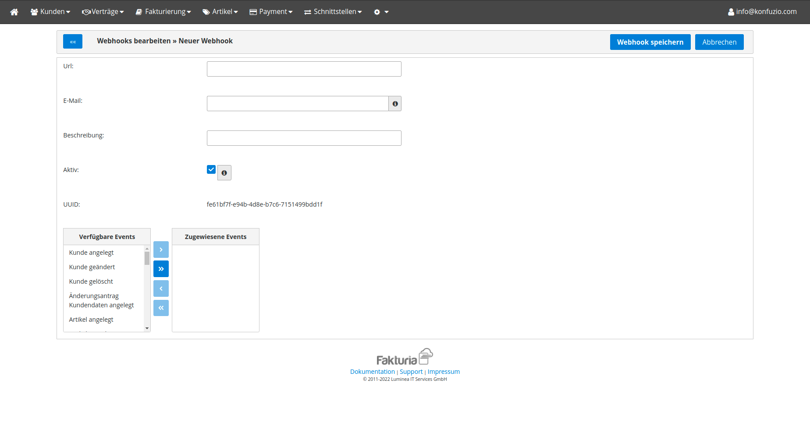

**Internal Documentation. This does not apply to on-premise Konfuzio Server installations.**

# Fakturia 

The pricing of Konfuzio is based on the number of pages a user processes. This pricing is enforced using [Fakturia](https://www.fakturia.de/).

## Set up

### To activate the billing, you need:
1. Set `IS_BILLING_ACTIVATED` environment variable to `True`
2. Run migrations
3. If this is set up on localhost, port forwarding to receive webhooks is needed (Ngrok can be used for this).

After that we continue with the setup of Fakturia

Please set `WEBHOOK_RANDOM_SECRET` environment variable to a random string.

After login into Fakturia [Sandbox](https://backoffice.sandbox.fakturia.de/public/login.html) or [Production](https://backoffice.fakturia.de/public/login.html) dashboard you need to open the [webhooks](https://backoffice.sandbox.fakturia.de/secure/tenant/Webhook/Webhook.html) page.

Then you need to create new webhook instance clicking `Neuen Webhook anlegen` button

You will need to fill form



Where

Url: {your_text_annotation_server_address}/webhook/fakturia/{WEBHOOK_RANDOM_SECRET}/
And from Verfügbare Events select next: 
- Kunde angelegt
- Kunde geändert
- Kunde gelöscht
- Vertrag angelegt
- Vertrag aktiviert
- Vertrag geändert
- Vertrag gelöscht
- Vertrag gekündigt
- Vertrag beendet (Vertragsende erreicht)

Click `Webhook speichern` button


Then open `Project` page. Click on edit button for any existing project. Go to `Schnittstelle` tab.

You will need a copy a `Api-Key` value from this page and set the `FAKTURIA_API_KEY` environment variable to it.
Also set `https://api.sandbox.fakturia.de/api/v1/` (for test environment) to `FAKTURIA_API_URL` environment variable.
Also on Projecte edit page add your IP address to `Neuen API-Key generieren` list and click `Projekt speichern`.

Now everything is ready to be used. You can create customers and subscriptions for them on Fakturia side and 
it will appear on your server. 

## Overview of Environment Variables

```
# Turn billing on/off (optional).
IS_BILLING_ACTIVATED=True
# Randomize the webhook URL (optional).
BILLLING_WEBHOOK_RANDOM_SECRET=secret
# The Billing API Key (mandatory, if billing is enabled).
BILLLING_API_KEY=7088127e-bb32-457d-836d-edbccd71bf0d
# The Billing Server (mandatory, if billing is enabled).
BILLLING_API_URL=https://api.sandbox.fakturia.de/api/v1/ or https://app.konfuzio.com
# The default contract to which all new Users are added automatically (mandatory, if billing is enabled).
BILLLING_DEFAULT_CONTRACT_ID = 100
# The default value for new Contracts for included Pages (optional).
BILLLING_ALLOWED_UPLOAD_COUNT=1
# The default value for the article number of additional Pages in new Contracts (optional).
BILLING_OVERLIMIT_ARTICLE_NUMBER_NEW_CONTRACTS = 'Overlimited_page'
# The default value for the article number of included Pages in new Contracts (optional).
BILLING_SUBSCRIPTION_ARTICLE_NUMBER_CONTRACTS = '00001'

# For on-premise Installations only FAKTURIA_API_URL and FAKTURIA_API_KEY are required.
```
